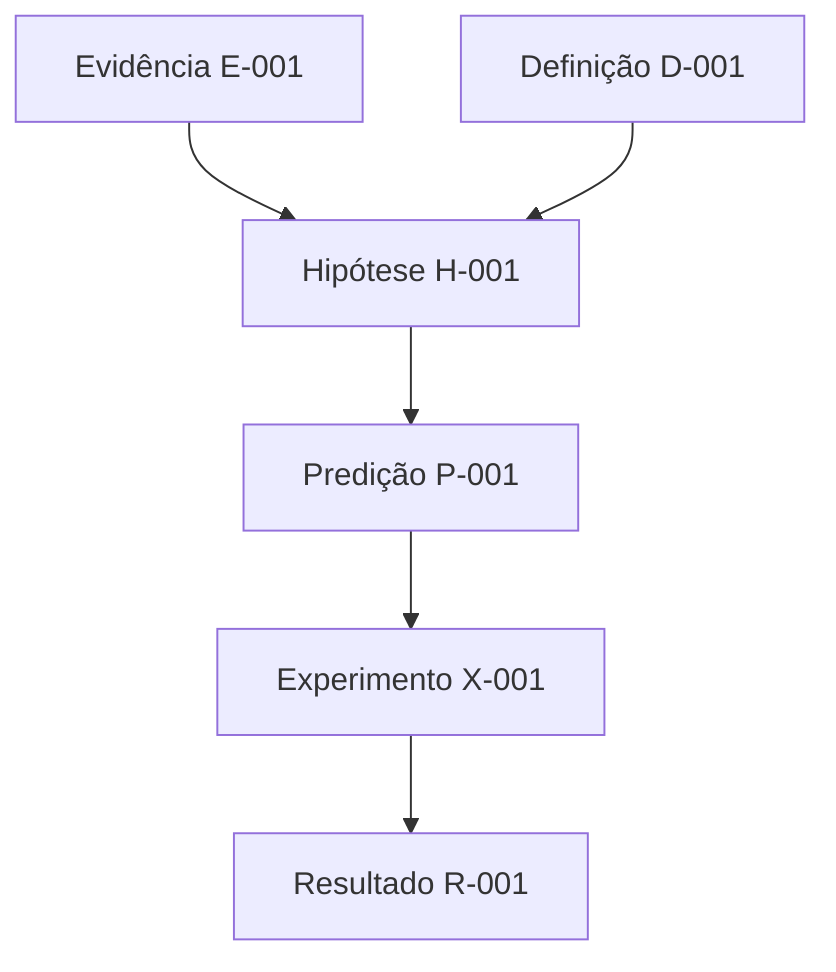
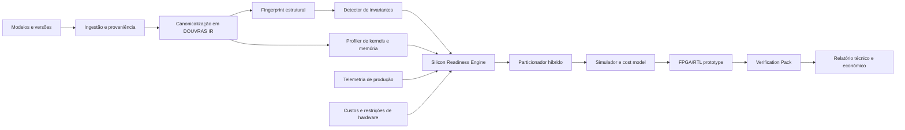

# Método DOUVRAS

## Um sistema operacional para descobrir, construir, testar e transformar conhecimento em tecnologia

> **Muitas formas. Uma estrutura.**
>
> **Da hipótese à estrutura. Da estrutura ao teste. Do teste ao sistema.**

---

# 1. Resumo executivo

O **Método DOUVRAS** é um processo integrado de descoberta científica, arquitetura de sistemas e construção de produtos. Ele foi criado para lidar com problemas grandes, interdisciplinares e inicialmente mal definidos sem transformar intuição em falsa certeza nem pesquisa em documentação sem aplicação.

O nome DOUVRAS representa sete movimentos:

1. **D — Delimitação**: definir exatamente o problema, o escopo, as restrições e o que contaria como sucesso ou falha;
2. **O — Observação**: coletar evidências, mapear o sistema real e distinguir fatos, relatos, medições e interpretações;
3. **U — Unificação**: encontrar relações, invariantes, estruturas recorrentes e representações comuns sem apagar diferenças importantes;
4. **V — Validação**: tentar refutar hipóteses, comparar com referências, reproduzir resultados e executar auditoria adversarial;
5. **R — Redução**: extrair a menor estrutura que preserva o fenômeno, o valor ou a capacidade desejada;
6. **A — Arquitetura**: transformar a estrutura validada em modelo, protocolo, experimento, software, hardware ou operação;
7. **S — Sistematização**: implantar, medir, versionar, documentar, operar e fazer o sistema produzir novas evidências.

O método conecta dois ciclos, mas não os confunde:

```text
CICLO CIENTÍFICO
Pergunta → definição → hipótese → formalização → experimento → auditoria → revisão

CICLO DE ENGENHARIA
Diagnóstico → requisitos → arquitetura → construção → implantação → operação → evolução
```

Uma hipótese científica não se torna verdadeira porque gerou um produto vendável. Um produto não se torna bom apenas porque nasceu de uma hipótese sofisticada. O Método DOUVRAS permite que pesquisa e mercado compartilhem dados, ferramentas e aprendizado, mantendo critérios de sucesso separados.

Este documento também aplica o método a uma oportunidade emergente: criar uma plataforma de software capaz de identificar quais modelos, camadas e padrões computacionais de IA estão maduros o suficiente para serem transformados em aceleradores especializados, FPGA, IP de silício ou ASIC.

A proposta resultante recebe o nome:

# **DOUVRAS Silicon Atlas**

> **Uma plataforma de inteligência e codesign que descobre quais partes da IA já estão estáveis o suficiente para virar silício.**

---

# 2. Por que o Método DOUVRAS existe

Problemas complexos normalmente fracassam por uma combinação de cinco erros:

1. o problema real não foi definido;
2. analogias foram tratadas como evidência;
3. ferramentas foram escolhidas antes da arquitetura;
4. protótipos foram confundidos com validação;
5. resultados não foram versionados, auditados ou transformados em aprendizado cumulativo.

O Método DOUVRAS foi projetado para impedir esses erros.

Ele parte de uma convicção:

> **A imaginação abre a investigação; a formalização determina o que pode sobreviver.**

A imaginação é necessária para formular novas conexões. A formalização é necessária para descobrir quais conexões são reais, úteis, testáveis ou apenas metafóricas.

O método não exige que toda investigação produza uma descoberta revolucionária. Um ciclo é bem-sucedido quando produz pelo menos um dos seguintes resultados:

- uma hipótese que sobreviveu a testes relevantes;
- uma hipótese refutada com clareza;
- um contraexemplo;
- uma estrutura mínima reutilizável;
- um benchmark;
- um modelo matemático ou computacional melhor definido;
- um software científico reproduzível;
- um produto operacional;
- um mapa confiável das lacunas restantes;
- uma decisão justificada de encerrar uma rota.

Resultados negativos fazem parte do patrimônio intelectual. Uma rota destruída por evidência evita que tempo, dinheiro e reputação sejam consumidos repetidamente pelo mesmo erro.

---

# 3. Contrato epistemológico

## 3.1 Regra principal

> **Nenhuma afirmação sem classificação de status.**

Toda afirmação relevante deve receber um status explícito.

| Status | Significado |
|---|---|
| `OBSERVATION` | Algo observado ou medido, ainda sem interpretação causal consolidada |
| `DEFINITION` | Convenção adotada para tornar o problema operacional |
| `ASSUMPTION` | Premissa usada, mas não demonstrada no projeto |
| `ANALOGY` | Semelhança útil para pensar, sem força de prova |
| `CONJECTURE` | Afirmação plausível ainda não demonstrada |
| `HYPOTHESIS` | Afirmação testável acompanhada de possíveis critérios de falha |
| `MODEL` | Representação formal, computacional ou estatística de um sistema |
| `COMPUTATIONAL_EVIDENCE` | Resultado de código ou simulação sob condições declaradas |
| `EXPERIMENTAL_EVIDENCE` | Resultado empírico obtido com protocolo e instrumentos documentados |
| `PARTIAL_RESULT` | Resultado válido em escopo limitado |
| `CONDITIONAL_RESULT` | Resultado válido apenas se hipóteses declaradas forem satisfeitas |
| `ENGINEERING_DECISION` | Escolha de projeto baseada em restrições e trade-offs |
| `EXTERNALLY_VERIFIED` | Resultado reproduzido ou aceito por avaliadores independentes |
| `RETRACTED` | Afirmação retirada após falha, erro ou evidência contrária |
| `OPEN_GAP` | Dependência ainda não resolvida |

## 3.2 O que é proibido

Não usar expressões como:

- “resolvido”;
- “provado”;
- “100% completo”;
- “revolucionário”;
- “universal”;
- “garantido”;
- “ASIC 100 vezes melhor”;

sem definir o objeto, a métrica, o baseline, o ambiente, o intervalo de validade e o tipo de evidência.

Em vez de:

> “O ASIC é 100 vezes mais rápido.”

Usar:

> “No benchmark B, para o modelo M, sequência S, lote N, precisão Q e consumo P, o protótipo apresentou X vezes o throughput do baseline G. O resultado ainda não foi reproduzido externamente.”

## 3.3 Uma afirmação principal por artefato

Cada relatório, experimento ou paper deve ter:

1. uma pergunta principal;
2. uma afirmação principal;
3. hipóteses numeradas;
4. dependências explícitas;
5. critérios de falha;
6. resultados;
7. limitações;
8. seção “o que este resultado não demonstra”.

---

# 4. As sete fases do Método DOUVRAS

# 4.1 D — Delimitação

## Objetivo

Transformar uma ambição ampla em uma pergunta operacional.

## Perguntas obrigatórias

- Qual é o problema exato?
- Quem sofre com ele?
- Em qual contexto ele ocorre?
- Quais variáveis podem ser controladas?
- Quais variáveis não podem ser controladas?
- Qual é a unidade de análise?
- O que está dentro do escopo?
- O que está fora?
- O que contaria como sucesso?
- O que contaria como falha?
- Qual decisão será tomada com o resultado?

## Artefato: `PROBLEM_CHARTER.md`

```markdown
# Problema

## Pergunta principal

## Usuário, sistema ou fenômeno afetado

## Estado atual

## Estado desejado

## Restrições

## Não objetivos

## Métricas de sucesso

## Critérios de falha

## Decisão que o estudo deverá permitir
```

## Portão D0 — Identidade do problema

A fase só termina quando:

- a pergunta cabe em uma frase;
- os termos principais estão definidos;
- o baseline está identificado;
- o que não conta como solução está escrito;
- existe pelo menos um critério de falha.

## Erro comum

Começar por “qual tecnologia usar?” antes de saber qual fenômeno ou operação precisa ser transformado.

---

# 4.2 O — Observação

## Objetivo

Construir uma representação fiel do sistema antes de tentar explicá-lo.

## Tipos de evidência

1. **Evidência primária**: medições, logs, código, documentos originais, experimentos, entrevistas diretas;
2. **Evidência secundária**: artigos de revisão, benchmarks agregados, análises de terceiros;
3. **Relato**: afirmação de pessoa ou empresa;
4. **Inferência**: conclusão extraída dos dados;
5. **Ausência de evidência**: campo ainda não medido.

Essas categorias não devem ser misturadas.

## Processo

1. mapear atores, componentes e fluxos;
2. registrar entradas, transformações e saídas;
3. coletar séries históricas quando possível;
4. localizar gargalos, desperdícios e falhas;
5. registrar versões, ambiente e condições;
6. identificar dados que faltam;
7. congelar um baseline inicial.

## Artefatos

### `EVIDENCE_LEDGER.yaml`

```yaml
- id: E-001
  claim_supported: C-003
  source_type: primary_measurement
  source: benchmark-run-2026-08-01.json
  conditions:
    model: example-model
    precision: int8
    batch: 1
  confidence: medium
  limitations:
    - single hardware platform
    - not independently reproduced
```

### `SYSTEM_MAP.md`

Deve conter:

- atores;
- componentes;
- dependências;
- fluxos de informação;
- fluxos de energia ou recursos;
- pontos de decisão;
- pontos de falha;
- interfaces externas.

### `GAP_REGISTER.md`

```markdown
| Gap | Por que importa | Evidência necessária | Responsável | Status |
|---|---|---|---|---|
| G-001 | Não sabemos o custo por token real | Telemetria de produção | Equipe A | OPEN |
```

## Portão O1 — Cobertura observacional

A fase termina quando:

- fatos e inferências estão separados;
- as principais fontes foram registradas;
- o baseline pode ser reproduzido;
- os principais gaps são conhecidos;
- o sistema real está descrito sem depender de linguagem promocional.

---

# 4.3 U — Unificação

## Objetivo

Descobrir a estrutura comum que atravessa casos, versões, escalas ou domínios diferentes.

Unificar não significa declarar que tudo é a mesma coisa. Significa procurar relações que permaneçam válidas após transformações controladas.

## Objetos procurados

- invariantes;
- simetrias;
- padrões recorrentes;
- subgrafos compartilhados;
- interfaces comuns;
- relações causais candidatas;
- leis de escala;
- estados e transições;
- gargalos dominantes;
- representações equivalentes;
- limites em que a equivalência deixa de funcionar.

## Técnica: Matriz de Transformações

Para cada componente, perguntar:

| Transformação | O que muda? | O que permanece? | O que quebra? |
|---|---|---|---|
| mudar escala |  |  |  |
| mudar versão |  |  |  |
| mudar precisão |  |  |  |
| mudar hardware |  |  |  |
| mudar usuário |  |  |  |
| remover componente |  |  |  |
| substituir implementação |  |  |  |

## Técnica: Grafo de dependências

Cada conclusão deve apontar para:

- dado primário;
- definição;
- hipótese;
- resultado conhecido sob hipóteses satisfeitas;
- resultado produzido pelo próprio projeto.

Qualquer seta preenchida por “parece”, “deve ser”, “é intuitivo” ou “todo mundo sabe” deve ser marcada como `OPEN_GAP`.

## Artefato: `DEPENDENCY_DAG.md`



## Artefato: `INVARIANT_MAP.md`

```markdown
| Candidato a invariante | Casos cobertos | Transformações testadas | Falhas conhecidas | Status |
|---|---|---|---|---|
| padrão de acesso à memória | 8 modelos | versão, quantização | MoE irregular | HYPOTHESIS |
```

## Portão U2 — Estrutura candidata

A fase termina quando:

- existe pelo menos uma estrutura comum definida;
- os casos que não se encaixam estão documentados;
- a estrutura produz uma previsão ou decisão distinguível;
- a unificação reduz complexidade sem apagar restrições essenciais.

---

# 4.4 V — Validação

## Objetivo

Tentar destruir a hipótese antes de transformá-la em produto, teoria ou investimento.

## Princípio

> **Código é instrumento de falsificação antes de ser instrumento de demonstração.**

## Validação mínima

1. comparar com baseline;
2. testar casos normais;
3. testar casos de fronteira;
4. testar dados adversariais;
5. variar parâmetros;
6. repetir em ambiente limpo;
7. verificar unidades, sinais e ordens de grandeza;
8. procurar contraexemplos pequenos;
9. testar hipóteses ocultas;
10. solicitar revisão de alguém que não construiu o artefato.

## Auditoria adversarial

O revisor interno deve procurar:

- primeiro passo inválido;
- hipótese oculta;
- dependência circular;
- baseline fraco;
- cherry-picking;
- confusão entre correlação e causalidade;
- vazamento de dados;
- benchmark não representativo;
- unidade incorreta;
- extrapolação além do domínio testado;
- resultado que desaparece ao mudar a semente;
- custo omitido;
- falha de segurança;
- mecanismo que só funciona porque o teste foi adaptado ao resultado.

## Artefato: `CLAIM_LEDGER.yaml`

```yaml
- id: C-001
  statement: "O subgrafo X permanece estável entre as versões A, B e C."
  status: HYPOTHESIS
  assumptions:
    - canonicalization preserves operator semantics
  evidence:
    - E-001
    - E-004
  falsifiers:
    - structural similarity below 0.80
    - accuracy loss above 1 percent after mapping
  owner: research
  last_reviewed: 2026-08-01
```

## Artefato: `COUNTEREXAMPLE_LOG.md`

Todo contraexemplo deve ser preservado. Ele pode revelar:

- uma fronteira de validade;
- uma nova classe de problema;
- uma hipótese melhor;
- uma arquitetura híbrida;
- um risco comercial.

## Portão V3 — Sobrevivência mínima

A hipótese avança apenas se:

- supera um baseline relevante;
- os resultados são reproduzíveis;
- não depende de uma hipótese oculta crítica;
- possui limitações explícitas;
- sobrevive a pelo menos uma revisão adversarial;
- ainda produz valor depois que alegações exageradas são removidas.

---

# 4.5 R — Redução

## Objetivo

Encontrar a menor unidade capaz de preservar o valor observado.

Esta é uma das partes mais importantes do método. Em vez de construir o sistema máximo, procura-se a **Unidade Mínima Invariante**, ou `UMI`.

## Unidade Mínima Invariante — UMI

Uma UMI é o menor conjunto de elementos que:

- preserva o comportamento essencial;
- mantém a métrica principal dentro do limite aceito;
- pode ser testado isoladamente;
- possui interfaces claras;
- pode ser substituído ou escalado;
- reduz dependências e custo.

## Procedimento de redução

1. remover componentes não essenciais;
2. substituir mecanismos complexos por aproximações;
3. comprimir estados e representações;
4. separar caminho crítico e caminho de controle;
5. localizar 20% das operações que consomem 80% do recurso;
6. procurar subproblemas repetidos;
7. fixar o que é estável;
8. manter programável o que muda com frequência;
9. comparar perda de qualidade com ganho de eficiência;
10. parar quando nova redução destruir o objetivo.

## Artefato: `MINIMAL_STRUCTURE.md`

```markdown
# Unidade Mínima Invariante

## Função preservada

## Componentes obrigatórios

## Componentes removidos

## Aproximações aceitas

## Limites de validade

## Interface de entrada

## Interface de saída

## Métricas antes e depois
```

## Portão R4 — Estrutura mínima operável

A fase termina quando:

- existe um núcleo testável;
- suas interfaces estão definidas;
- o custo marginal de complexidade adicional é conhecido;
- ficou claro o que deve ser fixo, configurável ou totalmente programável.

---

# 4.6 A — Arquitetura

## Objetivo

Transformar a estrutura mínima em uma solução executável.

A arquitetura deve responder:

- quais componentes existem;
- quais responsabilidades possuem;
- como se comunicam;
- quais estados armazenam;
- quais invariantes devem preservar;
- como falham;
- como são observados;
- como são atualizados;
- quais decisões permanecem humanas;
- quais decisões podem ser automatizadas.

## Camadas recomendadas

1. **Domínio**: conceitos e regras centrais;
2. **Dados**: schemas, proveniência e versionamento;
3. **Computação**: algoritmos e modelos;
4. **Orquestração**: filas, agentes, pipelines e estados;
5. **Interface**: APIs, CLI, dashboard e relatórios;
6. **Observabilidade**: logs, métricas, traces e alertas;
7. **Governança**: acesso, auditoria, rollback e políticas;
8. **Validação**: testes, benchmarks, simuladores e verificadores.

## Decisões arquiteturais

Cada decisão importante deve gerar um `ADR`.

### `ADR-0001.md`

```markdown
# Decisão

## Contexto

## Alternativas

## Decisão adotada

## Razões

## Consequências positivas

## Consequências negativas

## Evidência necessária para revisar esta decisão
```

## Portão A5 — Protótipo verificável

A arquitetura avança quando:

- o fluxo principal funciona ponta a ponta;
- há testes de contrato;
- o baseline é executado no mesmo ambiente;
- erros são observáveis;
- existe rollback;
- o protótipo pode ser reproduzido por outra pessoa.

---

# 4.7 S — Sistematização

## Objetivo

Fazer o resultado sobreviver ao tempo, ao uso, à troca de pessoas e à mudança do ambiente.

## O sistema deve produzir memória

Cada execução deve gerar dados capazes de melhorar:

- a hipótese;
- o modelo;
- a arquitetura;
- o produto;
- a operação;
- a decisão comercial.

## Elementos obrigatórios

- versionamento de código, dados, modelos e documentos;
- observabilidade;
- política de status;
- changelog de hipóteses;
- registro de incidentes;
- registro de resultados negativos;
- ambientes reproduzíveis;
- backups;
- permissões;
- documentação de interfaces;
- critérios de desligamento;
- métricas de adoção, custo, qualidade e confiabilidade;
- revisão periódica dos pressupostos.

## Portão S6 — Operação cumulativa

O sistema está sistematizado quando:

- pode ser operado sem depender da memória informal do criador;
- dados de produção retornam ao ciclo de pesquisa;
- existe uma política para corrigir ou retrair afirmações;
- custos reais podem ser comparados com os previstos;
- a próxima versão nasce de evidência, não apenas de preferência.

---

# 5. Os três loops do Método DOUVRAS 2.0

A melhoria central da versão 2.0 é executar três loops conectados.

## 5.1 Loop de descoberta

```text
Delimitar → Observar → Unificar → Validar
```

Objetivo: descobrir o que é verdadeiro, útil ou estrutural.

## 5.2 Loop de construção

```text
Reduzir → Arquitetar → Sistematizar
```

Objetivo: transformar o que sobreviveu em capacidade operacional.

## 5.3 Loop adversarial

```text
Alegação → Contraexemplo → Auditoria → Correção → Novo status
```

Objetivo: impedir que entusiasmo, investimento ou reputação promovam uma hipótese além da evidência.

Os três loops devem funcionar simultaneamente. Um produto em operação continua sendo auditado. Uma descoberta promissora continua sendo reduzida. Uma arquitetura continua gerando perguntas.

---

# 6. Melhorias incorporadas ao método

## 6.1 Critério de falha antes do experimento

Antes de executar um teste, declarar:

- qual resultado apoiaria a hipótese;
- qual resultado a enfraqueceria;
- qual resultado a refutaria;
- qual resultado seria inconclusivo.

Isso reduz o ajuste narrativo posterior.

## 6.2 Baseline congelado

O baseline deve ser versionado antes da otimização. Mudanças posteriores exigem novo comparativo.

## 6.3 Dívida de evidência

Toda decisão baseada em evidência fraca gera uma dívida registrada.

```markdown
| Decisão | Evidência atual | Risco | Evidência pendente | Data limite |
|---|---|---|---|---|
```

## 6.4 Kill criteria

Projetos devem possuir critérios de encerramento.

Exemplos:

- ganho menor que 20% após três ciclos;
- custo de aquisição maior que valor anual do cliente;
- precisão abaixo do limite mínimo;
- dependência de dados indisponíveis;
- impossibilidade de reprodução;
- obsolescência antes do ponto de equilíbrio;
- risco regulatório não mitigável.

Encerrar uma rota por critérios pré-definidos é governança, não fracasso.

## 6.5 Escada de especialização

Todo sistema deve declarar quanto está sendo especializado.

```text
Nível 0 — software genérico
Nível 1 — kernels otimizados
Nível 2 — compilação por família de operadores
Nível 3 — acelerador por arquitetura
Nível 4 — acelerador por família de modelos
Nível 5 — modelo e pesos parcialmente fixados
Nível 6 — modelo físico ou circuito integralmente fixado
```

Quanto maior o nível, maior pode ser a eficiência e maior é o risco de obsolescência.

## 6.6 Valor econômico também é falsificável

Uma solução tecnicamente superior pode ser economicamente inviável.

Toda proposta deve modelar:

- custo de desenvolvimento;
- custo não recorrente de engenharia;
- custo por unidade;
- custo de operação;
- volume necessário;
- vida útil esperada;
- custo de atualização;
- risco de fornecedor;
- tempo até o mercado;
- valor da flexibilidade perdida.

## 6.7 Uma pessoa não aprova sozinha a própria afirmação

Papéis mínimos:

- autor;
- adversário interno;
- auditor de fontes;
- auditor computacional;
- especialista externo;
- curador de status.

No início, uma pessoa pode acumular funções, mas a validação final não deve depender apenas de quem criou o resultado.

---

# 7. Estrutura padrão de repositório

```text
project/
├── 00_GOVERNANCE/
│   ├── STATUS_POLICY.md
│   ├── CLAIM_LEDGER.yaml
│   ├── EVIDENCE_LEDGER.yaml
│   ├── BIBLIOGRAPHY_LEDGER.yaml
│   ├── DECISION_LOG.md
│   └── RETRACTIONS_AND_CORRECTIONS.md
├── 01_DELIMITATION/
│   ├── PROBLEM_CHARTER.md
│   ├── DEFINITIONS.md
│   ├── ASSUMPTIONS.md
│   └── SUCCESS_AND_FAILURE.md
├── 02_OBSERVATION/
│   ├── SYSTEM_MAP.md
│   ├── DATA_SOURCES.md
│   ├── BASELINE/
│   └── GAP_REGISTER.md
├── 03_UNIFICATION/
│   ├── DEPENDENCY_DAG.md
│   ├── INVARIANT_MAP.md
│   ├── TRANSFORMATION_MATRIX.md
│   └── COMPETING_MODELS.md
├── 04_VALIDATION/
│   ├── EXPERIMENTS/
│   ├── COUNTEREXAMPLES/
│   ├── BENCHMARKS/
│   ├── EXTERNAL_REVIEWS/
│   └── REPRODUCIBILITY.md
├── 05_REDUCTION/
│   ├── MINIMAL_STRUCTURE.md
│   ├── ABLATIONS/
│   └── TRADEOFFS.md
├── 06_ARCHITECTURE/
│   ├── SYSTEM_DESIGN.md
│   ├── ADR/
│   ├── INTERFACES/
│   ├── SCHEMAS/
│   └── THREAT_MODEL.md
├── 07_SYSTEMATIZATION/
│   ├── OPERATIONS.md
│   ├── OBSERVABILITY.md
│   ├── RUNBOOKS/
│   ├── INCIDENTS/
│   └── CHANGELOG.md
└── 99_RELEASES/
    ├── reports/
    ├── datasets/
    ├── models/
    └── reproducibility-packs/
```

---

# 8. Ritual operacional de um ciclo DOUVRAS

## Dia 1 — Carta do problema

- escrever pergunta principal;
- definir termos;
- congelar baseline;
- listar não objetivos;
- registrar critério de falha.

## Dias 2–5 — Observação

- coletar fontes primárias;
- mapear fluxo real;
- importar dados;
- registrar lacunas;
- reproduzir o estado atual.

## Dias 6–10 — Unificação

- normalizar representações;
- procurar invariantes;
- construir DAG;
- comparar casos;
- formular hipóteses concorrentes.

## Dias 11–15 — Validação

- criar testes adversariais;
- procurar contraexemplos;
- executar ablações;
- comparar baselines;
- documentar resultado negativo.

## Dias 16–20 — Redução

- identificar núcleo dominante;
- remover componentes;
- separar fixo e programável;
- medir perda e ganho;
- definir UMI.

## Dias 21–25 — Arquitetura

- desenhar componentes;
- definir interfaces;
- implementar fluxo mínimo;
- incluir logs e testes;
- registrar ADRs.

## Dias 26–30 — Sistematização

- automatizar execução;
- empacotar reprodução;
- publicar relatório interno;
- atualizar status das alegações;
- definir próximo ciclo.

O calendário pode variar. O importante é que nenhum prazo transforme hipótese em conclusão automática.

---

# 9. Aplicação do método à oportunidade de ASICs para IA

# 9.1 A afirmação inicial

A tese recebida pode ser resumida assim:

> À medida que arquiteturas e modelos de IA de código aberto amadurecem, torna-se economicamente viável criar ASICs altamente especializados, potencialmente muito mais rápidos e eficientes que GPUs, usando CPU ou GPU para governar as partes flexíveis.

## Classificação inicial

| Parte da tese | Status inicial |
|---|---|
| ASICs podem ser mais eficientes que hardware genérico em cargas estáveis | `SUPPORTED_ENGINEERING_PRINCIPLE` |
| Modelos abertos já podem ser hardwired | `OBSERVED_IN_INDUSTRY_DEMO` |
| Um modelo inteiro permanecerá estável durante a vida econômica do chip | `HYPOTHESIS` |
| Todo ASIC ficará limitado a um único modelo | `OVERGENERALIZATION` |
| Ganho de 100x é possível | `CONDITIONAL_HYPOTHESIS` |
| Ganho de 100x é garantido comercialmente | `UNSUPPORTED` |

A ideia central é plausível, mas exige uma correção:

> **“ASIC de IA” não é uma única categoria. Existe um contínuo entre aceleradores programáveis, chips especializados em Transformer, chips especializados em famílias de modelos e circuitos que fixam pesos específicos.**

Um TPU ou NPU pode ser ASIC e ainda aceitar muitos modelos. Um chip Transformer-only pode aceitar diferentes Transformers. Um chip model-specific pode fixar formas, operadores ou pesos. O risco e o ganho mudam conforme o grau de especialização.

# 9.2 Evidência contemporânea relevante

Em 2026, a Taalas apresentou publicamente um demonstrador HC1 com **Llama 3.1 8B hardwired**, reportando 17 mil tokens por segundo por usuário. A empresa declara TSMC 6 nm, 815 mm² e 53 bilhões de transistores. Os números são divulgados pela própria empresa e precisam de reprodução independente, mas o produto demonstra que a ideia já ultrapassou o campo puramente hipotético.

O caso também mostra que “hardwired” não precisa significar rigidez absoluta: a implementação declara contexto configurável e suporte a ajustes por LoRA. Isso sustenta uma arquitetura híbrida: base fixa e deltas programáveis.

O artigo **Physical Foundation Models: Fixed hardware implementations of large-scale neural networks** argumenta que modelos fundacionais podem justificar hardware com parâmetros fixos ou majoritariamente fixos e que a eliminação de programabilidade pode produzir vantagens de várias ordens de grandeza. O próprio artigo trata isso como direção de pesquisa e registra desafios importantes de fabricação, atualização, controle, escala e validação.

Trabalhos recentes também exploram:

- projeções ternárias e pesos em memória somente leitura;
- aceleradores que fixam grande parte da rede e preservam uma camada programável;
- FPGAs para atenção linear e projeções inspiradas em BitNet;
- hardware especializado em partes do Transformer, não necessariamente no modelo inteiro.

Conclusão DOUVRAS:

> A oportunidade real não é apenas fabricar um “ASIC do Llama”. É construir a camada de inteligência que decide **o que deve virar silício, quanto deve ser fixado, por quanto tempo será útil e onde manter flexibilidade**.

---

# 10. Delimitação da oportunidade

## Pergunta principal

> Como identificar, antes de gastar milhões em fabricação, quais modelos, camadas, operadores, pesos, formas e fluxos de memória possuem estabilidade técnica e econômica suficiente para justificar especialização em FPGA, IP de silício ou ASIC?

## Usuários potenciais

- startups de chips;
- fabricantes de edge devices;
- empresas de semicondutores;
- laboratórios de modelos abertos;
- provedores de inferência;
- data centers;
- empresas de robótica;
- defesa, telecomunicações e indústria;
- empresas que executam grande volume de uma tarefa estável;
- investidores e equipes de diligência técnica.

## Não objetivo inicial

A DOUVRAS Labs não deve começar fabricando um ASIC completo.

O primeiro produto deve reduzir o risco de quem pretende fabricar ou integrar hardware especializado.

## Decisão que o software deve permitir

Para cada modelo ou subgrafo, responder:

1. deve permanecer em GPU/CPU?
2. deve receber kernel otimizado?
3. deve ser compilado para NPU/FPGA?
4. merece um bloco de IP especializado?
5. justifica um ASIC por arquitetura?
6. justifica pesos total ou parcialmente fixos?
7. qual é o ponto de equilíbrio econômico?

---

# 11. Produto proposto: DOUVRAS Silicon Atlas

## 11.1 Definição

**DOUVRAS Silicon Atlas** é uma plataforma SaaS e toolkit de engenharia que ingere modelos de IA, versões, traces de execução e parâmetros econômicos; converte os modelos para uma representação canônica; identifica estruturas estáveis; estima ganhos de especialização; gera protótipos e pacotes de verificação; e recomenda o grau ótimo de hardening.

## 11.2 Promessa do produto

> **Descobrir quais partes de um modelo já estão maduras o suficiente para virar hardware — antes do tape-out.**

## 11.3 O que o produto entrega

- mapa estrutural do modelo;
- fingerprint arquitetural;
- comparação entre versões;
- análise de estabilidade de operadores e formas;
- análise de estabilidade de pesos;
- hotspots de computação e memória;
- tolerância à quantização;
- candidatos a hardening;
- estimativa de throughput, latência, energia e área;
- estimativa de custo total e break-even;
- proposta de partição CPU/GPU/FPGA/ASIC;
- protótipo em software ou FPGA;
- contratos de teste;
- relatório de risco de obsolescência;
- pacote de evidências para investimento ou codesign.

---

# 12. Arquitetura funcional do Silicon Atlas



## 12.1 Model Registry & Watcher

Responsável por:

- registrar repositório, licença e origem;
- capturar versões;
- armazenar configuração, tokenizer e pesos;
- detectar mudanças em releases;
- preservar hash e proveniência;
- acompanhar adoção e volume de uso quando disponíveis.

Fontes possíveis:

- Hugging Face;
- GitHub;
- registries privados;
- artefatos ONNX;
- checkpoints PyTorch/JAX;
- telemetria do cliente.

## 12.2 Canonicalização — DOUVRAS IR

Modelos diferentes podem expressar a mesma computação de formas diferentes. É necessário convertê-los para uma representação intermediária capaz de expor:

- operadores;
- shapes;
- precisão;
- dependências;
- layout;
- fluxo de memória;
- sparsity;
- controle dinâmico;
- parâmetros fixos e configuráveis;
- estados persistentes, como KV cache.

A implementação pode usar MLIR como infraestrutura e criar dialetos DOUVRAS para representar:

- atenção;
- atenção linear;
- MLP;
- MoE;
- normalização;
- RoPE;
- quantização;
- cache;
- comunicação entre chips;
- blocos fixos;
- deltas programáveis.

## 12.3 Structural Fingerprint Engine

Produz um fingerprint por modelo, camada e subgrafo.

Exemplo:

```json
{
  "family": "decoder_transformer",
  "attention": "grouped_query",
  "layers": 32,
  "hidden_size": 4096,
  "mlp": "swiglu",
  "normalization": "rmsnorm",
  "position": "rope",
  "routing": "dense",
  "quantization_candidates": ["int8", "int4", "ternary"],
  "dynamic_regions": ["sampling", "context_length"]
}
```

## 12.4 Invariant Discovery Engine

Compara:

- versões do mesmo modelo;
- tamanhos da mesma família;
- famílias concorrentes;
- modelos adaptados por fine-tuning;
- modelos quantizados;
- workloads reais.

Técnicas possíveis:

- graph edit distance;
- subgraph isomorphism;
- hashing semântico de operadores;
- clustering de shapes;
- análise de frequência de kernels;
- similaridade de espectro ou distribuição de pesos;
- análise de sensibilidade;
- ablação;
- estabilidade temporal.

## 12.5 Runtime Profiler

Mede separadamente:

- prefill;
- decode;
- attention;
- MLP;
- roteamento MoE;
- comunicação;
- movimentação de pesos;
- KV cache;
- sampling;
- host overhead;
- utilização de memória e compute.

O objetivo é descobrir onde a energia e o tempo realmente são consumidos. Um bloco que representa 5% do custo não deve dominar o projeto apenas porque é intelectualmente interessante.

## 12.6 Silicon Readiness Engine

Calcula dois índices.

### Layer Hardening Score — LHS

Avalia a prontidão de uma camada ou subgrafo.

```text
LHS = 0,20E + 0,15F + 0,15R + 0,15Q + 0,15V + 0,10M + 0,10L
```

Onde:

- `E`: estabilidade estrutural;
- `F`: fração do custo total;
- `R`: regularidade computacional;
- `Q`: tolerância à quantização;
- `V`: volume de execução;
- `M`: previsibilidade de memória;
- `L`: vida útil esperada.

### Silicon Readiness Score — SRS

```text
SRS = 0,15A + 0,15H + 0,15T + 0,15P + 0,10Q + 0,10D + 0,10C + 0,10R
      - 0,15O - 0,10N
```

Onde:

- `A`: estabilidade arquitetural;
- `H`: concentração em hotspots;
- `T`: throughput anual necessário;
- `P`: ganho estimado de performance por watt;
- `Q`: robustez a baixa precisão;
- `D`: disponibilidade de dados e benchmarks;
- `C`: compatibilidade com codesign;
- `R`: receita ou economia potencial;
- `O`: risco de obsolescência;
- `N`: risco de NRE e fabricação.

Os pesos não são universais. Devem ser calibrados com casos reais e versionados.

## 12.7 Hybrid Partitioning Engine

Divide o modelo em regiões:

### Região fixa

Boa candidata quando:

- arquitetura e shapes são estáveis;
- peso ou operação muda raramente;
- volume é alto;
- acesso à memória é regular;
- quantização é aceitável.

### Região configurável

Boa candidata quando:

- muda entre clientes;
- depende de contexto;
- recebe LoRA;
- precisa de parâmetros atualizáveis;
- possui opções limitadas e previsíveis.

### Região programável

Necessária quando:

- há controle dinâmico;
- roteamento muda por token;
- novos operadores surgem frequentemente;
- precisão ou shape variam muito;
- segurança exige atualização;
- o modelo ainda está em rápida evolução.

A saída pode recomendar:

```text
ASIC/IP fixo: projeções MLP quantizadas e dataflow de pesos
Memória programável: LoRA e cabeças adaptadas
FPGA/eFPGA: operadores emergentes e roteamento
GPU/NPU: fallback
CPU: controle, sampling e orquestração
```

## 12.8 PPA & Economics Simulator

PPA significa:

- Power;
- Performance;
- Area.

O simulador precisa estimar:

- área lógica;
- SRAM/ROM;
- largura de banda;
- frequência;
- energia por token;
- latência;
- throughput;
- custo por wafer;
- yield estimado;
- encapsulamento;
- interconexão;
- NRE;
- vida útil econômica.

### Equação simplificada de break-even

```text
Volume_de_inferência_para_break_even =
NRE_total / (custo_GPU_por_inferência - custo_ASIC_por_inferência)
```

Ou, em tokens:

```text
Tokens_break_even =
NRE_total / (custo_GPU_por_token - custo_ASIC_por_token)
```

A equação real deve incorporar:

- custo de capital;
- depreciação;
- energia;
- refrigeração;
- manutenção;
- falhas;
- atualização;
- risco de demanda;
- custo de software;
- custo de oportunidade.

## 12.9 Prototype Generator

A plataforma não deve prometer gerar automaticamente um ASIC industrial completo no MVP.

Ela pode gerar progressivamente:

1. benchmark de referência;
2. kernel otimizado;
3. modelo de ciclo;
4. HLS;
5. RTL parametrizado;
6. testbench;
7. simulação Verilator;
8. protótipo FPGA;
9. síntese e estimativa física;
10. pacote para codesign com parceiro de semicondutores.

## 12.10 Verification Pack

Deve conter:

- golden model;
- vetores de teste;
- tolerâncias numéricas;
- testes diferenciais;
- testes de regressão;
- testes de overflow;
- propriedades formais;
- relatório de precisão;
- consumo estimado;
- limitações;
- hash de todos os artefatos.

---

# 13. Stack técnica recomendada

## 13.1 Ingestão e análise de modelos

- Python;
- PyTorch FX ou `torch.export`;
- ONNX;
- JAX/XLA quando necessário;
- safetensors;
- Hugging Face Transformers;
- Polars ou DuckDB para dados analíticos;
- PostgreSQL para metadados e governança;
- object storage compatível com S3 para artefatos.

## 13.2 Compiladores e IR

- MLIR como infraestrutura de representação multinível;
- dialetos próprios DOUVRAS;
- Apache TVM para experimentos de compilação e codegen;
- CIRCT para lowering em representações de circuito e geração de Verilog/SystemVerilog;
- Calyx ou Allo como referências para aceleradores composáveis;
- LLVM para partes de runtime e host.

## 13.3 Simulação e verificação

- Verilator;
- cocotb;
- pytest;
- SymbiYosys/Yosys para verificações aplicáveis;
- ferramentas de equivalência lógica do CIRCT;
- simuladores de arquitetura como gem5, quando úteis;
- modelos analíticos próprios para memória e interconexão.

## 13.4 RTL até layout exploratório

- Yosys;
- OpenROAD/OpenLane;
- Sky130 ou outras PDKs abertas para pesquisa e aprendizado;
- PDK comercial somente por parceria e acordo apropriado.

OpenROAD permite explorar o fluxo de RTL sintetizável até layout GDSII, mas um resultado em PDK aberta não equivale a um tape-out competitivo em nó avançado.

## 13.5 Produto SaaS

- Next.js para dashboard;
- FastAPI ou Rust para APIs de análise;
- workers Python/Rust;
- Temporal ou filas equivalentes para pipelines longos;
- Kubernetes apenas quando a escala justificar;
- OpenTelemetry;
- Grafana;
- armazenamento versionado;
- isolamento por projeto e cliente.

## 13.6 Segurança e propriedade intelectual

- modelos privados não devem ser enviados a serviços externos sem autorização;
- criptografia em trânsito e repouso;
- segregação de tenants;
- execução on-premise para clientes sensíveis;
- logs auditáveis;
- política de retenção;
- controle de exportação e compliance;
- contrato claro sobre propriedade de RTL, pesos, relatórios e melhorias genéricas.

---

# 14. Experimento inaugural usando o Método DOUVRAS

## 14.1 Pergunta

> Existem subgrafos de inferência que permanecem estruturalmente estáveis em múltiplas versões e famílias de modelos abertos e concentram computação suficiente para justificar hardware especializado?

## 14.2 Hipóteses

### H1 — Estabilidade parcial

Alguns blocos, como projeções MLP quantizadas, normalização, RoPE e partes do fluxo de atenção, permanecem mais estáveis que o modelo completo.

### H2 — Valor concentrado

Uma pequena quantidade de padrões computacionais concentra a maior parte do custo de inferência.

### H3 — Arquitetura híbrida domina hardwiring total

Fixar apenas os blocos estáveis e preservar regiões programáveis produz melhor valor econômico ajustado ao risco que fixar o modelo inteiro.

### H4 — Baixa precisão aumenta a viabilidade

Modelos ou camadas tolerantes a INT4, ternário ou outra baixa precisão possuem maior potencial de hardening.

## 14.3 Falsificadores

- baixa similaridade entre subgrafos ao longo das versões;
- hotspots mudando com frequência;
- perda de qualidade acima do limite;
- ganhos pequenos após considerar memória e comunicação;
- break-even posterior à vida útil esperada;
- custo de verificação e software anulando a economia;
- volume de uso insuficiente.

## 14.4 Dataset inicial

Selecionar:

- três a cinco famílias de modelos abertos;
- três versões por família quando existirem;
- tamanhos pequenos e médios;
- variantes quantizadas;
- workloads de chat, código e extração estruturada;
- traces de prefill e decode.

Não escolher o vencedor antecipadamente. O objetivo do primeiro ciclo é validar o detector de estabilidade.

## 14.5 Experimentos

1. importar e canonicalizar modelos;
2. gerar fingerprints;
3. comparar subgrafos;
4. medir hotspots em GPU e CPU;
5. testar INT8, INT4 e, quando aplicável, ternário;
6. executar ablações;
7. estimar PPA;
8. gerar um microacelerador FPGA para o bloco mais promissor;
9. comparar resultado real com o modelo de custo;
10. atualizar os pesos do SRS.

## 14.6 Resultado mínimo publicável

Mesmo que nenhum ASIC seja economicamente viável, o projeto pode produzir:

- dataset de evolução estrutural de modelos;
- taxonomia de estabilidade;
- benchmark de hardening;
- compilador de subgrafos;
- modelo de break-even;
- resultado negativo documentado;
- microacelerador reproduzível.

---

# 15. MVP em 90 dias

## Dias 1–15 — Delimitação e corpus

Entregas:

- `PROBLEM_CHARTER.md`;
- esquema do Model Registry;
- três famílias de modelos;
- ingestão de configurações e grafos;
- baseline de profiling;
- `CLAIM_LEDGER.yaml`.

## Dias 16–30 — DOUVRAS IR e fingerprints

Entregas:

- representação canônica inicial;
- normalização de operadores;
- fingerprint por camada;
- diff entre versões;
- dashboard simples de mudanças.

## Dias 31–45 — Invariantes e hotspots

Entregas:

- detector de subgrafos recorrentes;
- profiler de prefill/decode;
- ranking de custo;
- `INVARIANT_MAP.md`;
- primeiro Layer Hardening Score.

## Dias 46–60 — Quantização e cost model

Entregas:

- testes INT8/INT4;
- sensibilidade por camada;
- estimativa de memória;
- modelo inicial de energia e throughput;
- break-even configurável.

## Dias 61–75 — Particionamento híbrido

Entregas:

- regiões fixa/configurável/programável;
- recomendação por modelo;
- relatório de risco de obsolescência;
- APIs do Silicon Readiness Engine.

## Dias 76–90 — Prova pré-hardware

Entregas:

- microkernel em HLS ou RTL;
- simulação Verilator;
- testbench diferencial;
- comparação com baseline;
- relatório técnico;
- demonstração web.

## Critério de sucesso do MVP

O MVP não precisa fabricar chip. Ele precisa provar que consegue:

1. detectar mudanças estruturais;
2. localizar blocos estáveis;
3. estimar benefício;
4. produzir uma recomendação auditável;
5. gerar ao menos um protótipo verificável.

---

# 16. Roadmap de 12 a 24 meses

## 3–6 meses

- ampliar corpus;
- calibrar SRS;
- adicionar telemetria real;
- suportar MoE e atenção híbrida;
- gerar FPGA para dois blocos;
- buscar parceria acadêmica ou de hardware.

## 6–12 meses

- lançar SaaS privado;
- oferecer análise on-premise;
- integrar CIRCT e OpenROAD ao pipeline;
- publicar benchmark técnico;
- fechar primeiro estudo pago de viabilidade;
- desenvolver biblioteca de IP parametrizado.

## 12–18 meses

- protótipo FPGA completo de um caminho de inferência limitado;
- codesign com fabricante ou design house;
- validação externa;
- modelo de licenciamento de IP;
- criação de runtime híbrido.

## 18–24 meses

Uma destas rotas, escolhida por evidência:

1. licenciar o software de análise;
2. licenciar blocos de IP;
3. codesenvolver um chiplet;
4. participar de MPW/tape-out experimental;
5. especializar a plataforma em edge, voz, visão, robótica ou inferência de linguagem;
6. encerrar a rota de silício e manter o produto como inteligência de otimização.

---

# 17. Modelo de negócio

## 17.1 Produto de entrada

### Silicon Readiness Assessment

Relatório pago contendo:

- análise do modelo;
- estabilidade;
- hotspots;
- quantização;
- arquitetura proposta;
- PPA preliminar;
- break-even;
- riscos;
- roadmap de protótipo.

## 17.2 Receita recorrente

### Silicon Atlas Enterprise

Cobrança por:

- modelos monitorados;
- versões analisadas;
- volume de profiling;
- seats;
- execução on-premise;
- módulos de codesign;
- atualização contínua de benchmarks.

## 17.3 Serviços de maior valor

- codesign de acelerador;
- implementação FPGA;
- geração de RTL;
- verificação;
- diligência técnica para investidores;
- análise make-versus-buy;
- integração com NPU/ASIC existente.

## 17.4 Propriedade intelectual

Possíveis ativos defensáveis:

- corpus histórico normalizado;
- fingerprints;
- método de detecção de invariantes;
- modelo de risco de obsolescência;
- DOUVRAS IR;
- bibliotecas de microarquiteturas;
- dados reais de previsão versus implementação;
- contratos de verificação;
- integração entre análise técnica e economia.

O moat principal não deve ser apenas o dashboard. Deve ser a base acumulada de comparações entre modelo, workload, arquitetura e resultado físico.

---

# 18. Riscos principais

## 18.1 Modelos mudam antes do chip

Mitigação:

- endurecimento parcial;
- LoRA e deltas programáveis;
- eFPGA ou bloco configurável;
- seleção por vida útil;
- modelagem explícita de obsolescência.

## 18.2 Benchmarks promocionais

Mitigação:

- baselines congelados;
- workloads públicos;
- reprodução externa;
- divulgação de lote, contexto, precisão e consumo;
- separar números do fabricante de resultados independentes.

## 18.3 Memória domina computação

Mitigação:

- modelar movimentação de dados desde o início;
- explorar ROM, SRAM, compressão e compute-in-memory;
- separar prefill e decode;
- evitar estimar ganho apenas por operações aritméticas.

## 18.4 ASIC economicamente inviável

Mitigação:

- vender análise antes do hardware;
- começar por FPGA e IP;
- usar break-even como gate;
- exigir volume contratado ou parceiro âncora.

## 18.5 Ferramentas abertas não refletem nó avançado

Mitigação:

- tratar OpenROAD/Sky130 como ambiente de aprendizado e comparação;
- calibrar modelos com dados industriais quando houver parceria;
- não anunciar PPA exploratório como previsão de produção.

## 18.6 Licença dos modelos

Mitigação:

- registrar licença e versão;
- avaliar direito de redistribuição e derivação;
- não incorporar pesos em silício sem análise jurídica;
- permitir execução privada com pesos do cliente.

## 18.7 Dependência de fornecedor e geopolítica

Mitigação:

- arquiteturas portáveis;
- abstração de PDK;
- múltiplos backends;
- análise de export controls;
- parceiros regionais.

---

# 19. Decisão estratégica recomendada para a DOUVRAS Labs

A melhor entrada não é competir imediatamente com NVIDIA, Google, Taalas ou fabricantes de chips.

A entrada defensável é:

> **Ser a camada de descoberta, auditoria e codesign que transforma modelos em decisões de silício.**

## Ordem recomendada

1. construir o Model Registry;
2. criar DOUVRAS IR;
3. detectar invariantes entre versões;
4. medir hotspots;
5. modelar quantização;
6. calcular SRS;
7. gerar relatório de viabilidade;
8. criar microacelerador FPGA;
9. vender assessment;
10. formar parceria para IP ou tape-out.

## Primeira tese técnica

> O hardware economicamente vencedor provavelmente não será totalmente genérico nem totalmente fixo. Será uma arquitetura estratificada na qual o caminho dominante e estável é endurecido, enquanto adaptação, controle e operadores emergentes permanecem programáveis.

## Primeira tese comercial

> Antes de cada empresa investir milhões em um ASIC, ela precisa responder se o modelo sobreviverá tempo suficiente, onde está o ganho real e qual parte deve permanecer flexível. O Silicon Atlas vende essa resposta e os artefatos que a sustentam.

---

# 20. Checklist para iniciar imediatamente

## Governança

- [ ] criar repositório `douvars-silicon-atlas`;
- [ ] adicionar política de status;
- [ ] criar claim ledger;
- [ ] criar gap register;
- [ ] congelar o baseline.

## Corpus

- [ ] selecionar três famílias de modelos;
- [ ] registrar licenças;
- [ ] coletar versões;
- [ ] armazenar configs e grafos;
- [ ] registrar hashes.

## Engenharia

- [ ] importar modelo;
- [ ] exportar grafo;
- [ ] normalizar operadores;
- [ ] criar fingerprint;
- [ ] comparar versões;
- [ ] executar profiling;
- [ ] gerar relatório HTML/Markdown.

## Pesquisa

- [ ] definir hipóteses;
- [ ] registrar falsificadores;
- [ ] testar subgrafos;
- [ ] executar quantização;
- [ ] localizar primeiro candidato a UMI.

## Produto

- [ ] criar dashboard de estabilidade;
- [ ] criar Silicon Readiness Score;
- [ ] criar calculadora de break-even;
- [ ] gerar relatório comercial;
- [ ] preparar demonstração com um modelo aberto.

---

# 21. Templates rápidos

## 21.1 Cartão de hipótese

```markdown
# H-XXX — Nome

Status: HYPOTHESIS

## Afirmação

## Motivação

## Hipóteses

## Predições

## Evidência favorável

## Evidência contrária

## Falsificadores

## Experimento mínimo

## Limites

## Próxima decisão
```

## 21.2 Cartão de experimento

```markdown
# X-XXX — Nome

## Hipótese testada

## Baseline congelado

## Variáveis controladas

## Variáveis medidas

## Hardware e software

## Dataset

## Protocolo

## Critério de sucesso

## Critério de falha

## Resultado

## Reprodutibilidade

## Interpretação permitida

## Interpretação proibida
```

## 21.3 Cartão de candidato a silício

```markdown
# SC-XXX — Candidato

## Subgrafo

## Modelos cobertos

## Estabilidade temporal

## Percentual do custo total

## Precisões suportadas

## Padrão de memória

## Controle dinâmico

## Ganho estimado

## Risco de obsolescência

## NRE estimado

## Break-even

## Recomendação

- [ ] permanecer em software
- [ ] kernel otimizado
- [ ] FPGA
- [ ] bloco de IP
- [ ] ASIC por arquitetura
- [ ] pesos parcialmente fixos
- [ ] pesos integralmente fixos
```

---

# 22. Referências técnicas e institucionais

## Base DOUVRAS

1. **DOUVRAS Labs — Rebrand, Manifesto e Diretriz Institucional**, versão 1.0, 31 de julho de 2026.
2. **Relatório Integral do Programa de Pesquisa Tamesis 2026**, corte documental de 28 de julho de 2026.
3. **ROADMAP CLAY 2026**, governança de alegações, DAGs, gaps, falsificação e revisão adversarial.

## Hardware de IA

4. **Taalas — The Path to Ubiquitous AI**, 2026. Demonstração HC1 com Llama 3.1 8B hardwired; métricas declaradas pelo fabricante.
5. Wright, L. G.; Wang, T.; Onodera, T.; McMahon, P. L. **Physical Foundation Models: Fixed hardware implementations of large-scale neural networks**. arXiv:2604.27911, 2026.
6. **ELiTeFormer: An Efficient Transformer for FPGAs**. arXiv:2607.03652, 2026.
7. **TOM: A Ternary Read-only Memory Accelerator for LLM Inference**. arXiv:2602.20662, 2026.
8. Herbst, J.; Pellauer, M.; Reda, S. **HaShiFlex: A High-Throughput Hardened Shifter DNN Accelerator with Fine-Tuning Flexibility**. arXiv:2512.12847, 2025.

## Compiladores e EDA

9. **MLIR — Multi-Level Intermediate Representation**, LLVM Project.
10. **CIRCT — Circuit IR Compilers and Tools**, LLVM Project.
11. **Apache TVM**, compiler stack para modelos e hardware heterogêneo.
12. **OpenROAD**, fluxo aberto de RTL sintetizável a layout GDSII.

---

# 23. Conclusão

O Método DOUVRAS não é uma técnica de brainstorming nem uma sequência rígida de gestão de projetos. Ele é um sistema para transformar ambição em conhecimento auditável e conhecimento em capacidade operacional.

Seu princípio pode ser resumido assim:

```text
Não comece pela ferramenta.
Comece pelo problema.

Não confunda relação com prova.
Transforme relação em hipótese.

Não proteja a hipótese.
Tente destruí-la.

Não construa o máximo.
Encontre a estrutura mínima que preserva o valor.

Não entregue apenas um protótipo.
Construa um sistema que mede, aprende e corrige a si mesmo.
```

Aplicado aos ASICs de IA, o método produz uma oportunidade concreta: em vez de apostar cegamente em um modelo específico, construir uma plataforma que observa a evolução dos modelos, encontra estruturas invariantes, mede seus custos, valida candidatos em software e FPGA e determina o nível economicamente correto de especialização.

A pergunta deixa de ser:

> “Qual modelo devemos gravar em um ASIC?”

E passa a ser:

> **“Qual parte da inteligência já se tornou estruturalmente estável, economicamente durável e fisicamente vantajosa o suficiente para deixar de ser apenas software?”**

Essa é a pergunta que o **DOUVRAS Silicon Atlas** deve responder.

---

> **DOUVRAS Labs — Muitas formas. Uma estrutura.**
