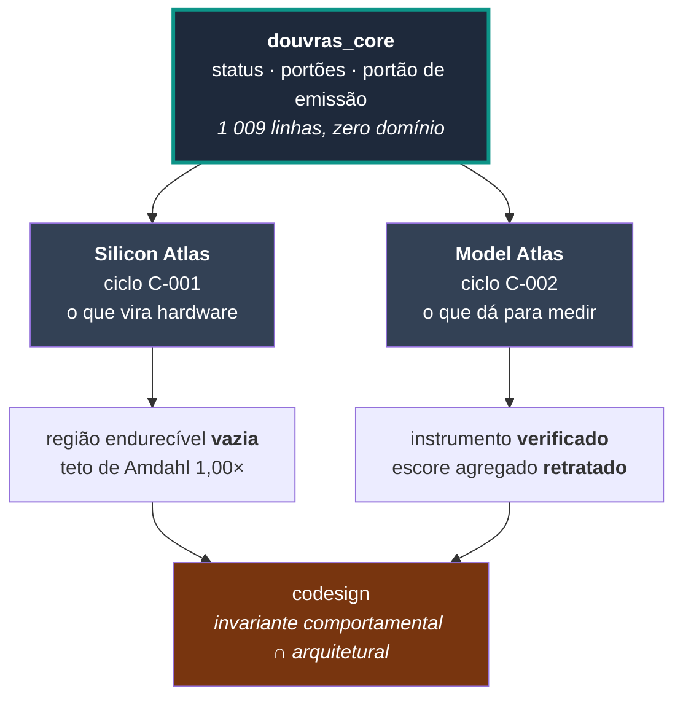
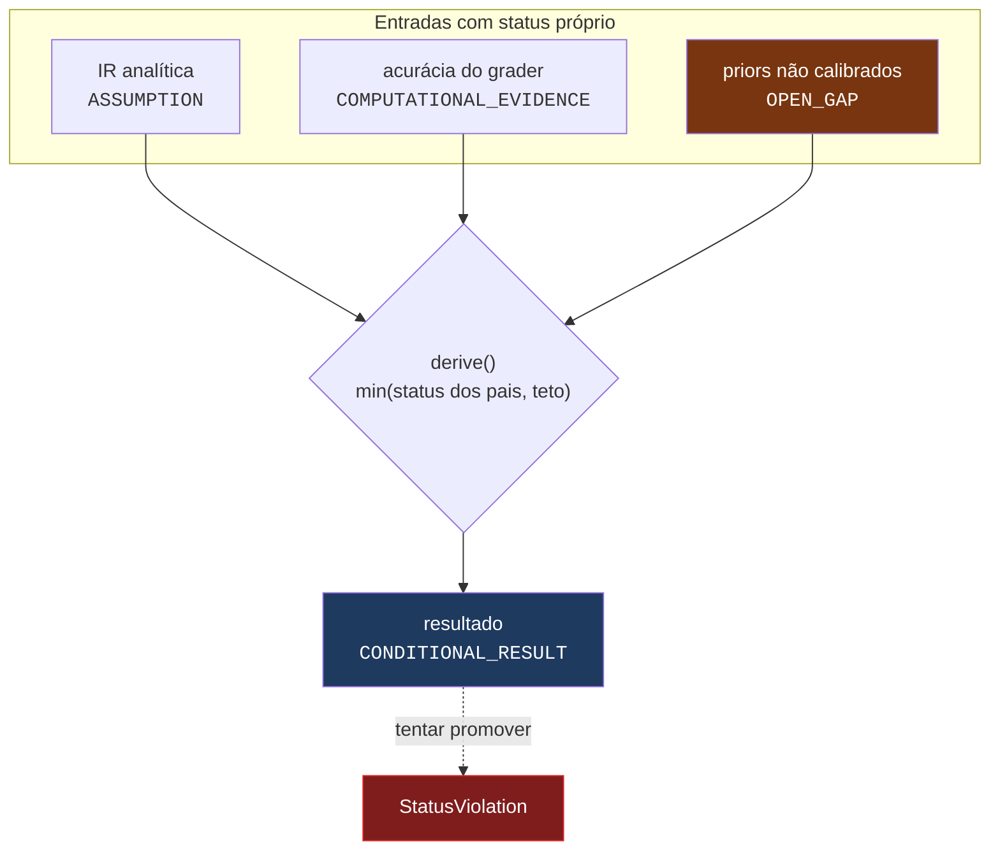

<div align="center">

# DOUVRAS

**Dois eixos de pesquisa sobre o mesmo contrato epistêmico: o que num modelo de IA está maduro
para virar silício, e o que num modelo de IA está maduro para ser medido.**

[](METODO_DOUVRAS.md)
[](tests/)
[](#os-dois-eixos)
[](#estado-dos-portões)
[](#o-que-o-sistema-retratou-de-si-mesmo)

[](00_GOVERNANCE/STATUS_POLICY.md)
[](pyproject.toml)
[](#instalação)
[](#instalação)

</div>

---

## O que é

Implementação executável do [Método DOUVRAS](METODO_DOUVRAS.md). O método não é decoração
deste repositório — ele **roda**:

- nenhum número sai de um motor sem status epistêmico;
- nenhuma conclusão é mais forte que sua dependência mais fraca, imposto por tipo e não por
  disciplina;
- nenhum relatório é emitido fora do contrato — o portão recusa;
- critérios de falha são declarados **antes** do experimento e avaliados por código.

Dois ciclos concluídos, sobre problemas diferentes. Nos dois, a resposta foi negativa — e nos
dois a negativa é o produto. Um sistema que só sabe dizer "sim" não é instrumento de decisão.

## Os dois eixos



O nó de codesign está em marrom porque **ainda não existe**: ele só é calculável quando houver
capacidade medida em mais de um modelo. Uma interface entre os dois eixos hoje seria
acoplamento sem conteúdo.

| | [Silicon Atlas](silicon-atlas/) | [Model Atlas](model-atlas/) |
|---|---|---|
| pergunta | que parte deste modelo está estável, dominante em custo e tolerante a baixa precisão o bastante para virar silício? | em qual capacidade este modelo falha, e o instrumento que mede isso é confiável? |
| entrada | 9 `config.json`, 5 famílias | 96 tarefas pt-BR, 8 capacidades, 132 contraexemplos |
| produto | Silicon Readiness Assessment | Model Capability Assessment |
| resposta do ciclo | **não**: nenhum caso justifica máscara com a evidência disponível | **ainda não**: nenhum modelo executado; o instrumento, sim, foi verificado |
| falsificadores disparados | 3 de 5 | 1 de 6 |
| portão bloqueado | V3 | V3 |

## Instalação

```bash
pip install -e ".[dev]"        # numpy, pyyaml, pytest — nada mais
python -m pytest tests         # 231 testes
```

Nenhum dos dois eixos exige GPU, pesos de modelo, `torch` ou rede no caminho principal
([ADR-0001](silicon-atlas/06_ARCHITECTURE/ADR/ADR-0001-ir-analitica.md) ·
[ADR-0006](model-atlas/06_ARCHITECTURE/ADR/ADR-0006-execucao-opcional.md)). Os dois assessments
rodam **antes** de qualquer NDA e antes de qualquer compra de hardware.

```bash
python scripts/run_silicon_cycle.py    # ciclo C-001: 9 assessments de silício
python scripts/build_task_corpus.py    # gera as 96 tarefas do BR-Agent-Bench
python scripts/run_model_cycle.py      # ciclo C-002: 3 assessments de capacidade
```

---

## O contrato epistêmico, em código



Este bloco é literalmente o mesmo código nos dois eixos. Um `Finding` de custo analítico e um
`Finding` de capacidade medida se combinam pela mesma regra do elo mais fraco — e é isso que
torna o codesign possível depois, em vez de exigir tradução entre dois vocabulários.

A extração do core foi o **teste** dessa afirmação: se a escala de status só servisse para
hardware, seria vocabulário de domínio disfarçado de epistemologia. Ela migrou sem uma linha de
adaptação ([ADR-0005](model-atlas/06_ARCHITECTURE/ADR/ADR-0005-douvras-core.md)), e
`tests/core/` a valida sem importar nenhum dos dois atlas.

---

## Resultados

### Silicon Atlas — ciclo C-001

Nos nove modelos, **nenhum papel passa simultaneamente pelos três limiares** de estabilidade,
economia e quantização. Região endurecível vazia, teto de Amdahl **1,00×** — um ganho de 100×
é inalcançável nesta partição por aritmética, independentemente do silício.

Com região fixa vazia, o simulador **recusa** dimensionar um acelerador: não emite área, NRE
nem break-even. A recusa em produzir números sobre um objeto inexistente é o produto.

Detalhes em [silicon-atlas/README.md](silicon-atlas/README.md).

### Model Atlas — ciclo C-002

| Medida do instrumento | Valor |
|---|---:|
| aceitação do gabarito | **100,0 %** (96/96) |
| rejeição de contraexemplo | **100,0 %** (132) |
| precisão do rótulo | **100,0 %** |
| determinismo | idêntico entre execuções |
| modos de falha sem sonda | nenhum |
| **margem de discriminação agregada** | **0,062** ← abaixo do limiar de 0,20 |

O grader aceita todo gabarito e rejeita todo contraexemplo com o rótulo certo. O **escore
agregado**, porém, não separa um respondente correto de um degenerado: cada sonda ataca uma
família e o agregado dilui o dano pelo corpus inteiro. `C-102` foi retratada.

Detalhes em [model-atlas/README.md](model-atlas/README.md).

---

## O que o sistema retratou de si mesmo

Seis afirmações publicadas foram retiradas pelos próprios critérios declarados antes.

| # | Eixo | Afirmação retirada | O que a derrubou |
|---|---|---|---|
| [R-001](silicon-atlas/00_GOVERNANCE/RETRACTIONS_AND_CORRECTIONS.md) | silício | o ranking do LHS é estável | falsificador F3, declarado antes |
| [R-002](silicon-atlas/00_GOVERNANCE/RETRACTIONS_AND_CORRECTIONS.md) | silício | banda `optimized_kernel` em 8 dos 9 relatórios | o fator vinha de um acelerador que o próprio relatório declarava inexistente |
| [R-003](silicon-atlas/00_GOVERNANCE/RETRACTIONS_AND_CORRECTIONS.md) | silício | "nenhum NRE foi estimado" | falso no mesmo `run_id`: o Markdown suprimia, o JSON publicava |
| [R-004](silicon-atlas/00_GOVERNANCE/RETRACTIONS_AND_CORRECTIONS.md) | silício | estabilidade 1,000 para famílias sem transição | o sistema premiava **ausência de dado** |
| [R-005](silicon-atlas/00_GOVERNANCE/RETRACTIONS_AND_CORRECTIONS.md) | silício | três afirmações do README | intervalo escrito de memória em vez de calculado |
| [R-101](model-atlas/00_GOVERNANCE/RETRACTIONS_AND_CORRECTIONS.md) | capacidade | o escore agregado do benchmark discrimina | falsificador F3, com 0,062 contra o limiar de 0,20 |

Em nenhum dos seis casos a métrica foi redefinida para caber no resultado. Redefinir um
falsificador depois de vê-lo disparar é ajustar o instrumento ao resultado, e está proibido por
decisão registrada nos dois eixos (`D-008`, `D-106`).

---

## Estado dos portões

```bash
PYTHONPATH=src python -m silicon_atlas.cli gates
PYTHONPATH=src python -m model_atlas.cli gates
```

| Portão | Silicon Atlas | Model Atlas |
|---|:---:|:---:|
| **D0** — identidade do problema | ✅ | ✅ |
| **O1** — cobertura observacional | ✅ | ✅ |
| **U2** — estrutura candidata | ✅ | ✅ |
| **V3** — sobrevivência mínima | ❌ | ❌ |
| **R4** — estrutura mínima operável | ✅ | ✅ |
| **A5** — protótipo verificável | ✅ | ✅ |
| **S6** — operação cumulativa | ✅ | ✅ |

V3 está bloqueado nos dois eixos **por decisão, não por omissão**: o Método §6.7 exige que a
validação final não dependa de quem criou o resultado. Agentes revisando agentes não fecham
esse portão, e os dois diretórios de revisão externa estão vazios de propósito.

---

## Estrutura

```text
DOUVRAS/
├── METODO_DOUVRAS.md          o método completo — as sete fases, os portões, os contratos
├── 00_GOVERNANCE/             política de status e decisões de nível monorepo
├── docs/                      a tese que originou o eixo de capacidade (3 documentos)
│
├── src/
│   ├── douvras_core/          1 009 linhas — status, portões, emissão. Zero domínio.
│   ├── silicon_atlas/         6 390 linhas — IR, roofline, invariantes, partição, economia
│   └── model_atlas/           3 168 linhas — tarefas, graders, sondas, capacidade, CSS
│
├── silicon-atlas/             ciclo C-001: 7 fases DOUVRAS, priors, corpus, 9 assessments
├── model-atlas/               ciclo C-002: 7 fases DOUVRAS, priors, corpus, 3 assessments
│
├── scripts/
│   ├── run_silicon_cycle.py   regenera os artefatos do eixo de silício
│   ├── run_model_cycle.py     regenera os artefatos do eixo de capacidade
│   └── build_task_corpus.py   gera o BR-Agent-Bench a partir dos templates
│
└── tests/
    ├── core/                  27 testes — o contrato, sem nenhum domínio
    ├── silicon/               149 testes
    └── model/                 55 testes
```

Arquivos marcados **[GERADOS]** dentro dos projetos não devem ser editados: são saída, não
entrada. O que se edita são os priors em `config/`, os corpora, os templates de tarefa e as
alegações em `CLAIM_LEDGER.yaml`.

---

## ⚠️ Limitações honestas

Este repositório **não** demonstra que qualquer modelo deva virar ASIC, **não** mede a
capacidade de nenhum modelo, e **não** substitui síntese física nem avaliação humana.

**No eixo de silício** — o roofline não foi calibrado contra latência medida; a tolerância à
quantização é prior de literatura; a energia do alvo especializado é modelo analítico comparado
com TDP de GPU, assimetria que favorece estruturalmente o alvo. **13 lacunas abertas e 1
parcial.**

**No eixo de capacidade** — o corpus é sintético e até prova em contrário mede o gerador, não o
mundo; as sondas foram escritas por quem escreveu o grader; nenhuma ficha de modelo foi
conferida na fonte; os priors do CSS nunca foram calibrados. **11 lacunas abertas.**

**Nos dois** — o limiar que produz a conclusão do ciclo não tem base empírica. No silício é
`min_stability = 0,60`; na capacidade é a margem de `0,20`. Nos dois casos, afrouxar o limiar é
a manobra mais provável sob pressão comercial, e nos dois casos ele mora em arquivo ou constante
nomeada: agora aparece no `git diff`.

Enquanto houver lacuna aberta, nenhum resultado passa de `CONDITIONAL_RESULT` — literalmente:
tentar promover levanta `StatusViolation`.

---

## Posição estratégica

> **Ser a camada de descoberta e auditoria que determina o que merece virar chip e o que merece
> virar dataset — e que diz "ainda não" quando for o caso, com a aritmética à vista.**

Um assessment que conclui *"não vale a pena fabricar"* é uma entrega bem-sucedida. Um benchmark
que conclui *"meu próprio escore agregado não decide nada"* também. Um sistema que sempre
recomendasse agir seria mais fácil de vender e destruiria o único ativo que o produto tem.

O modelo comercial derivado disso está em
[docs/03_MODELO_DE_NEGOCIO_E_PRECIFICACAO.md](docs/03_MODELO_DE_NEGOCIO_E_PRECIFICACAO.md).

---

<div align="center">

**DOUVRAS Labs** — Muitas formas. Uma estrutura.

<sub>Da hipótese à estrutura. Da estrutura ao teste. Do teste ao sistema.</sub>

</div>
