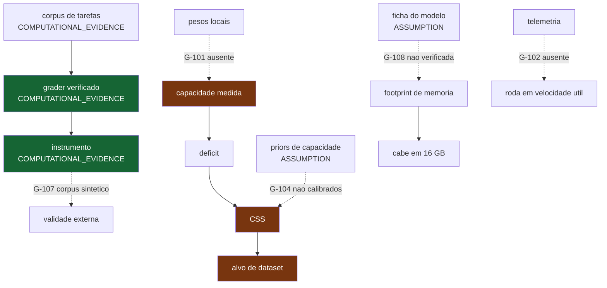

# Grafo de dependencias

> Arquivo **gerado**. As setas tracejadas sao lacunas abertas — os lugares onde a
> cadeia ainda nao fecha.

## Onde a cadeia fecha

Do corpus ao instrumento verificado, sem lacuna pendurada: sao afirmacoes sobre
codigo e corpus que estao no repositorio e reexecutam identicos.

## Onde a cadeia nao fecha

| Aresta ausente | Lacuna | Consequencia |
|---|---|---|
| pesos locais -> capacidade medida | `G-101` | nenhuma capacidade e medida; o CSS nao tem entrada |
| priors calibrados -> CSS | `G-104` | mesmo com medicao, o alvo carrega premissa nao demonstrada |
| ficha verificada -> footprint | `G-108` | o 'cabe?' herda a aproximacao da contagem de parametros |
| telemetria -> velocidade util | `G-102` | caber nao e rodar, e o relatorio nao pode dizer que roda |
| corpus real -> validade externa | `G-107` | o instrumento mede o gerador ate prova em contrario |

Lacunas registradas neste ciclo: **10 abertas**.
