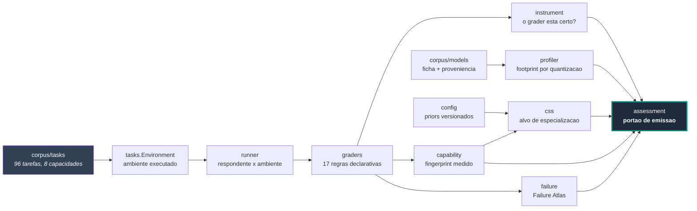

# Desenho do sistema — Model Atlas

## Cadeia

Cada elo pode apenas **enfraquecer** a confiança, nunca fortalecê-la — a mesma propriedade do
Silicon Atlas, imposta pelo mesmo `douvras_core`.

## Camadas

| Camada | Módulos | Depende de |
|---|---|---|
| contrato | `douvras_core.status`, `.gates`, `.report`, `.paths` | nada |
| vocabulário | `tasks` | contrato |
| avaliação | `graders`, `runner` | vocabulário |
| medida | `instrument`, `capability`, `failure` | avaliação |
| interpretação | `css`, `profiler`, `registry` | medida, priors |
| emissão | `assessment`, `cli` | tudo acima |

Nenhuma seta aponta para trás. `graders` não sabe o que é um modelo; `capability` não sabe o
que é uma regra de acerto.

## A fronteira que mais importa

`CapabilityFingerprint.from_run` é o único ponto onde execução vira afirmação sobre modelo, e
é onde a recusa do `ADR-0007` está implementada. Uma execução sintética entra e sai como
ausência declarada. Não há segundo caminho: `assessment` não constrói fingerprint por conta
própria.

## O que é entrada, o que é saída

Entrada: templates em `scripts/build_task_corpus.py`, fichas em `corpus/models/`, priors em
`config/`, alegações em `CLAIM_LEDGER.yaml`.

Saída: `corpus/tasks/*.json`, `03_UNIFICATION/FAILURE_MAP.md`, `X-002-RESULT.md`,
`99_RELEASES/reports/*`, `last_verification.json`.

## Portão de emissão

Cinco verificações, cada uma correspondendo a uma falha que já aconteceu de verdade em algum
eixo deste repositório:

| Verificação | Origem |
|---|---|
| seções obrigatórias | Método §3.3 |
| vocabulário proibido | Método §3.2 |
| número não-finito | `R-003` do Silicon Atlas: um `NaN` chegou à afirmação principal de quatro relatórios |
| coerência interna | `G-012`: a seção dizia "nada foi dimensionado" e o anexo publicava NRE |
| promoção à mão | `Finding` construído direto com status acima do dos pais que ele mesmo declara |

## Interface com o Silicon Atlas

Nenhuma, hoje — de propósito. Os dois eixos compartilham o core e nada mais. O ponto de contato
previsto pelo Documento 2 é a interseção entre **invariante comportamental** (uma capacidade
estável entre modelos) e **invariante arquitetural** (um bloco estável entre versões). Essa
interseção só é calculável quando `G-101` fechar e houver capacidade medida em mais de um
modelo; até lá, uma interface entre os dois seria acoplamento sem conteúdo.
