# Grafo de dependencias

> Arquivo **gerado** a partir de CLAIM_LEDGER.yaml, EVIDENCE_LEDGER.yaml, ASSUMPTIONS.md
> e GAP_REGISTER.md. Nenhuma aresta vem de memoria informal.

Toda conclusao aponta para o que a sustenta. Arestas tracejadas terminam em **lacuna
aberta** — sao os lugares onde a cadeia ainda nao fecha, e o Metodo 4.3 exige que sejam
visiveis em vez de preenchidas por 'parece' ou 'e intuitivo'.

```mermaid
graph TD
    E001["E-001<br/><i>medicao</i>"]
    E002["E-002<br/><i>relato de fabricante</i>"]
    E003["E-003<br/><i>literatura</i>"]
    E004["E-004<br/><i>ausencia de evidencia</i>"]
    E005["E-005<br/><i>literatura</i>"]
    A001(["A-001 premissa"])
    A002(["A-002 premissa"])
    A003(["A-003 premissa"])
    A004(["A-004 premissa"])
    A005(["A-005 premissa"])
    A006(["A-006 premissa"])
    A007(["A-007 premissa"])
    A008(["A-008 premissa"])
    A009(["A-009 premissa"])
    G001[/"G-001 lacuna aberta"/]
    G002[/"G-002 lacuna aberta"/]
    G003[/"G-003 lacuna aberta"/]
    G004[/"G-004 lacuna aberta"/]
    G005[/"G-005 lacuna aberta"/]
    G006[/"G-006 lacuna aberta"/]
    G007[/"G-007 lacuna aberta"/]
    G008[/"G-008 lacuna aberta"/]
    G009[/"G-009 lacuna aberta"/]
    G010[/"G-010 lacuna aberta"/]
    G011[/"G-011 lacuna aberta"/]
    G012[/"G-012 lacuna aberta"/]
    G013[/"G-013 lacuna aberta"/]
    G014[/"G-014 lacuna aberta"/]
    C001{{"C-001<br/>HYPOTHESIS"}}
    C002{{"C-002<br/>HYPOTHESIS"}}
    C003{{"C-003<br/>HYPOTHESIS"}}
    C004{{"C-004<br/>CONDITIONAL_HYPOTHESIS"}}
    C005{{"C-005<br/>HYPOTHESIS"}}
    C006{{"C-006<br/>RETRACTED"}}
    C007{{"C-007<br/>HYPOTHESIS"}}
    C008{{"C-008<br/>HYPOTHESIS"}}
    A001 --> C001
    A002 --> C002
    A005 --> C002
    A002 --> C003
    A002 --> C004
    A003 --> C004
    A006 --> C004
    E002 --> C004
    E003 --> C004
    A006 --> C005
    A007 --> C005
    A001 --> C007
    A009 --> C007
    A001 --> C008
    G001 -.-> A001
    G003 -.-> A002
    G004 -.-> A003
    G002 -.-> A004
    G003 -.-> A005
    G005 -.-> A006
    G006 -.-> A007
    G007 -.-> A008
    G008 -.-> A009
    class C006 retratada;
    classDef retratada fill:#7f1d1d,color:#fff,stroke:#dc2626;
```

## Alegacoes retratadas

- **C-006** — O ranking de candidatos a hardening produzido pelo SRS e estavel sob perturbacao de +-20 por cento nos pesos do score.
  - motivo: Falsificador F3 da PROBLEM_CHARTER. Se falhar, toda recomendacao derivada e retratada. | falsificador disparado | F3 reforcado (CE-001): o LHS nao separa candidatos por mais que o ruido dos proprios pesos em nenhum modelo do corpus

## Alegacoes sem nenhuma evidencia anexada

- C-005

## Contagem

- alegacoes: 8
- itens de evidencia: 5
- premissas: 9
- lacunas abertas: 14

Enquanto houver aresta tracejada chegando a uma premissa que sustenta uma alegacao, essa
alegacao nao pode passar de `CONDITIONAL_RESULT`. A regra e verificada em codigo por
`Finding.__post_init__`, nao por leitura deste diagrama.
