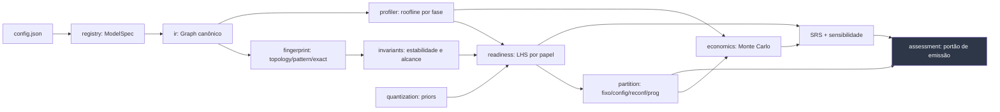

# Arquitetura do DOUVRAS Silicon Atlas

## Princípio de organização

O sistema é uma cadeia de transformações onde **cada elo pode apenas enfraquecer a confiança,
nunca fortalecê-la**. Isso não é uma limitação: é a propriedade que torna o resultado auditável.
`Finding.derive()` implementa a regra, e nenhum motor pode contorná-la.

## Camadas (Método §4.6)

| Camada | Módulo | Responsabilidade | Status que pode emitir |
|---|---|---|---|
| Governança | [status.py](../src/silicon_atlas/status.py) | escala de status, propagação, lint, claim ledger | — |
| Dados | [registry.py](../src/silicon_atlas/registry.py) | normalização, proveniência, hash, licença | `OBSERVATION` se verificado |
| Domínio | [ir/](../src/silicon_atlas/ir/) | grafo canônico, FLOPs, bytes, shapes simbólicos | `MODEL` |
| Computação | [profiler.py](../src/silicon_atlas/profiler.py) · [quantization.py](../src/silicon_atlas/quantization.py) | roofline, hotspots, planos de precisão | `COMPUTATIONAL_EVIDENCE` |
| Computação | [fingerprint.py](../src/silicon_atlas/fingerprint.py) · [invariants.py](../src/silicon_atlas/invariants.py) | identidade estrutural, diff, estabilidade | `COMPUTATIONAL_EVIDENCE` |
| Decisão | [readiness.py](../src/silicon_atlas/readiness.py) · [partition.py](../src/silicon_atlas/partition.py) | LHS, SRS, sensibilidade, regiões | `CONDITIONAL_RESULT` |
| Decisão | [economics.py](../src/silicon_atlas/economics.py) | PPA, NRE, break-even, obsolescência | `CONDITIONAL_RESULT` |
| Interface | [assessment.py](../src/silicon_atlas/assessment.py) · [cli.py](../src/silicon_atlas/cli.py) | orquestração, portão de emissão, relatório | herda o elo mais fraco |
| Validação | [tests/](../tests/) | golden checks, falsificadores, regressões | — |

## Invariantes que o sistema deve preservar

1. **Nenhum `Finding` sem status.** Imposto por `__post_init__`.
2. **Nenhum resultado acima do elo mais fraco.** Imposto por `derive()`.
3. **Nenhum `Finding` com lacuna aberta acima de `CONDITIONAL_RESULT`.** Imposto por construção.
4. **Nenhum relatório sem as oito seções do Método §3.3.** Imposto por `EmissionRefused`.
5. **Nenhum relatório com vocabulário proibido.** Imposto por `lint_text` no portão.
6. **Nenhum score emitido sem análise de sensibilidade.** Imposto por `EmissionRefused`.
7. **Arquitetura desconhecida falha alto.** `UnsupportedArchitecture` em vez de grafo silenciosamente errado.

Cada invariante tem teste correspondente em [test_status_contract.py](../tests/test_status_contract.py)
e [test_assessment_gate.py](../tests/test_assessment_gate.py).

## Como os módulos falham

| Módulo | Falha típica | Comportamento projetado |
|---|---|---|
| `registry` | arquitetura sem construtor | exceção nomeada, modelo excluído do corpus com motivo registrado |
| `ir` | campo de config ausente | `KeyError` explícito — nunca valor default silencioso |
| `profiler` | dtype sem pico declarado no device | fallback declarado em cascata, registrado na saída |
| `readiness` | fator não computável | `Finding` com `OPEN_GAP`, que rebaixa a cadeia inteira |
| `economics` | região fixa vazia | relatório declara ausência de objeto, não break-even infinito |
| `assessment` | contrato violado | `EmissionRefused` — o relatório não sai |

## Observabilidade

Todo assessment emite `FindingSet` completo (Anexo D do relatório) com: nome, valor, unidade,
status, premissas e lacunas de **cada** número que entrou na conclusão. Não há número órfão.

`atlas gates` reporta o estado dos portões D0→S6 a qualquer momento.

## O que ainda não existe (e está declarado)

- Importador de grafo traçado (`torch.export`/ONNX) — interface prevista, `G-001`.
- Emissão de HLS/RTL e simulação Verilator — Método §12.9, itens 4 a 7.
- Persistência multi-tenant, API HTTP, dashboard — Método §13.5.
- Calibração dos pesos LHS/SRS — `G-011`, bloqueado por ausência de casos com desfecho.

Nada disso é necessário para o produto de entrada (Método §17.1), que é o assessment.

## Modelo de ameaças resumido

| Ameaça | Mitigação atual |
|---|---|
| Pesos de cliente vazarem | o Atlas nunca lê pesos; opera sobre `config.json` (ADR-0001) |
| Número analítico ser citado como medição | status obrigatório + lint + Anexo D |
| Priors otimistas inflarem recomendação | priors versionados, sensibilidade obrigatória, `G-002` explícita |
| Corpus adulterado | hash de proveniência + teste de contagem de parâmetros contra valor publicado |
| Escopo escolhido para favorecer conclusão | seção "efeito do escopo" obrigatória no relatório |
