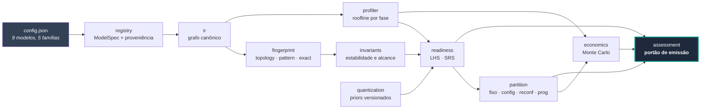
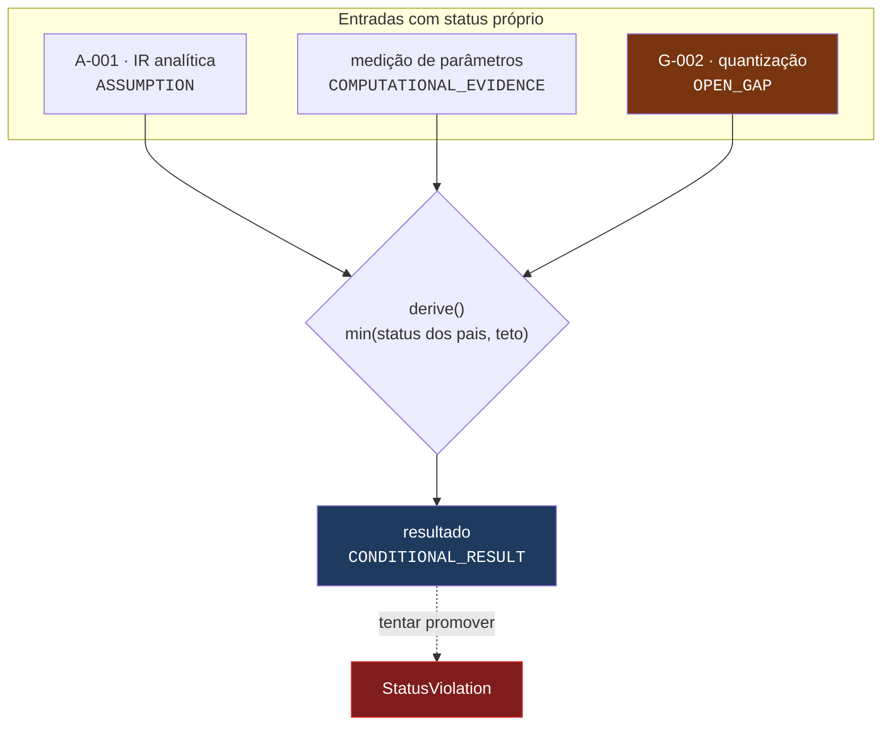
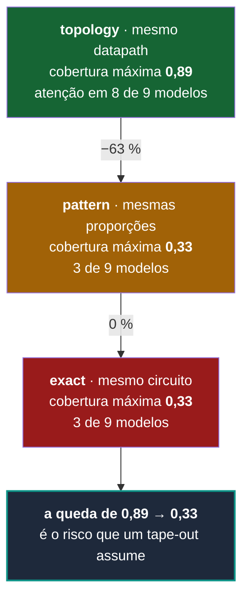
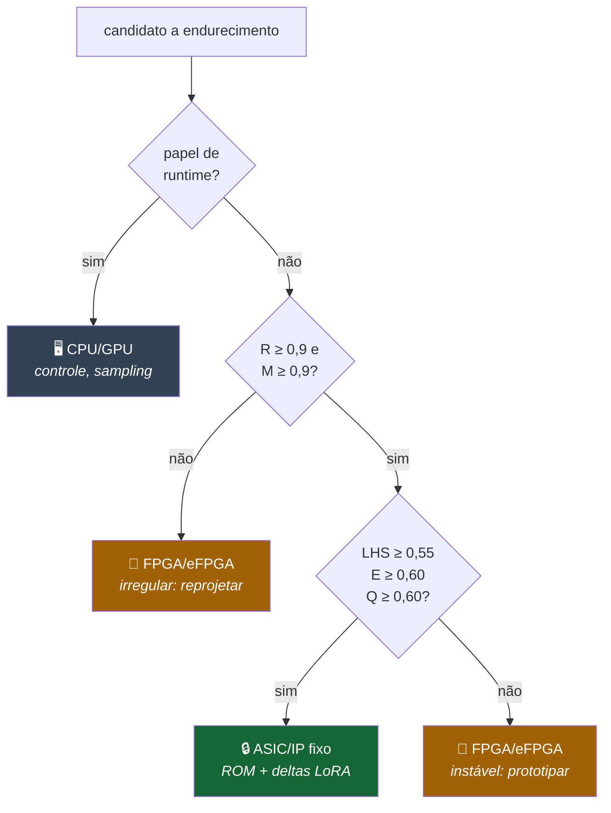

<div align="center">

# DOUVRAS Silicon Atlas

**Descobre quais partes de um modelo de IA já estão estáveis, dominantes em custo e tolerantes a
baixa precisão o suficiente para virar silício — e a partir de qual volume isso se paga.**

[](../METODO_DOUVRAS.md)
[](04_VALIDATION/EXPERIMENTS/X-001-RESULT.md)
[](../tests/silicon/)
[](#-portões-do-ciclo)
[](02_OBSERVATION/GAP_REGISTER.md)

[](../00_GOVERNANCE/STATUS_POLICY.md)
[](07_SYSTEMATIZATION/OBSERVABILITY.md)
[](00_GOVERNANCE/RETRACTIONS_AND_CORRECTIONS.md)
[](pyproject.toml)
[](06_ARCHITECTURE/ADR/ADR-0001-ir-analitica.md)

</div>

---

## O que é

Implementação do **Método DOUVRAS** aplicado à decisão de especialização em silício para modelos
de IA. O método não é decoração deste repositório: ele é **executável**.

- Nenhum número sai de um motor sem status epistêmico.
- Nenhuma conclusão é mais forte que sua dependência mais fraca — imposto por tipo, não por
  disciplina.
- Nenhum relatório é emitido fora do contrato — o portão recusa.
- Critérios de falha são declarados **antes** do experimento e avaliados por código.

A resposta que o sistema deu no ciclo C-001, para os nove modelos do corpus, foi **não**: nenhum
caso justifica máscara com a evidência disponível. Um sistema que só sabe dizer "sim" não é
instrumento de decisão.

## Instalação e uso

A partir da raiz do monorepo [DOUVRAS](../README.md):

```bash
pip install -e ".[dev]"                # numpy, pyyaml, pytest — nada mais
python -m pytest tests/core tests/silicon   # 176 testes
python scripts/run_silicon_cycle.py    # ciclo completo: regenera artefatos e verifica a suíte
```

Não requer GPU, pesos de modelo, `torch` nem rede ([ADR-0001](06_ARCHITECTURE/ADR/ADR-0001-ir-analitica.md)).
O assessment roda sobre um `config.json` público — antes de qualquer NDA.

---

## Arquitetura



Cada elo pode apenas **enfraquecer** a confiança, nunca fortalecê-la. Não é limitação — é a
propriedade que torna o resultado auditável.

### O contrato epistêmico, em código



Um roofline analítico **nunca** vira evidência experimental, por melhores que sejam suas entradas.
Uma lacuna aberta trava o resultado em `CONDITIONAL_RESULT`. Tentar burlar levanta exceção.

---

## Resultados do ciclo C-001

> Todos os números abaixo são medidos por `scripts/run_silicon_cycle.py` e reproduzíveis com semente fixa.
> Nenhum passa de `CONDITIONAL_RESULT` — nenhum sustenta sozinho uma decisão de tape-out.

### 1 · A IR reproduz os nove modelos ao parâmetro

Erro **0,00 %** contra as contagens publicadas pelos autores, atravessando MHA, GQA, MoE,
embeddings amarrados, viés em QKV e as quatro normalizações por camada do Gemma-2.

| Modelo | Família | Parâmetros derivados | Atenção | Publicado bate? |
|---|---|---:|:---:|:---:|
| `llama-2-7b` | llama | 6 738 415 616 | MHA | ✅ |
| `llama-3-8b` | llama | 8 030 261 248 | GQA | ✅ |
| `llama-3.1-8b` | llama | 8 030 261 248 | GQA | ✅ |
| `mistral-7b-v0.1` | mistral | 7 241 732 096 | GQA | ✅ |
| `mixtral-8x7b-v0.1` | mistral | 46 702 792 704 | GQA + MoE | ✅ |
| `qwen2.5-7b` | qwen | 7 615 616 512 | GQA | ✅ |
| `qwen2.5-14b` | qwen | 14 770 033 664 | GQA | ✅ |
| `phi-3-mini-4k` | phi | 3 821 079 552 | MHA | ✅ |
| `gemma-2-9b` | gemma | 9 241 705 984 | GQA | ✅ |

Um campo transcrito errado quebraria a igualdade exata. **Falsificador F5 não disparado.**

### 2 · O decode é um problema de memória, não de aritmética

`llama-3.1-8b` · H100 SXM · prompt 2048 · geração 512 · lote 1 · bf16:

| Métrica | Prefill | Decode |
|---|---:|---:|
| tokens/s | 34 808 | **174,7** |
| intensidade aritmética | 624,7 FLOP/byte | **1,06 FLOP/byte** |
| ponto de inflexão do dispositivo | 253,2 | 92,3 |
| tempo limitado por memória | 15,0 % | **99,9 %** |
| energia por token | 32,6 mJ | 6 491 mJ |

O decode consome **98,0 %** do tempo da requisição e opera **duas ordens de grandeza abaixo** do
ponto de inflexão. Estimar ganho de hardening por FLOPs superestima o benefício — a mitigação do
Método §18.3, agora medida em vez de afirmada.

**Onde o custo está:**

```
gate_proj  ████████████████████████  24,5 %  ┐
up_proj    ████████████████████████  24,5 %  ├─ MLP = 73,4 % da requisição
down_proj  ████████████████████████  24,5 %  ┘
q_proj     ███████                    7,0 %
o_proj     ███████                    7,0 %
lm_head    ██████                     6,7 %
kv_read    ██                         1,9 %
```

Quantizar para o plano de sensibilidade reduz o tráfego de leitura em **50 %** e rende **1,96×**
em decode — **sem tocar em silício**. A perda de qualidade correspondente não foi medida (`G-002`).

### 3 · "Transformers são estáveis" é 89 % verdade — no nível errado

A mesma frase, medida em três níveis de identidade estrutural sobre os nove modelos:



Um roadmap que cita estabilidade **arquitetural** para justificar **máscara** está usando
evidência do nível errado. É o erro que este repositório existe para tornar visível.

**Circuitos exatos já atravessam famílias** — convergência sem coordenação entre laboratórios:

| Bloco | Modelos que compartilham o **mesmo circuito** |
|---|---|
| atenção | `llama-3-8b` · `llama-3.1-8b` · `mixtral-8x7b-v0.1` |
| MLP | `llama-3-8b` · `llama-3.1-8b` · `mistral-7b-v0.1` |

Alcance de mercado e estabilidade temporal são propriedades **independentes**, e ambas precisam
ser verdadeiras para justificar um bloco de IP.

### 4 · O escopo de comparação muda a resposta — e é escolha do analista

| Família | Versões | Transições | Topologia | Padrão | Exato | Mudanças/ano |
|---|:---:|:---:|:---:|:---:|:---:|:---:|
| llama | 3 | 2 | 1,00 | 0,50 | **0,50** | 0,98 |
| mistral | 2 | 1 | 0,33 | 0,00 | **0,00** | 4,87 |
| qwen | 2 | 0 | — | — | — | — |
| gemma | 1 | 0 | — | — | — | — |
| phi | 1 | 0 | — | — | — | — |

`llama-3-8b → llama-3.1-8b`: **1,00** de estabilidade exata em 96 dias, com apenas
`max_position_embeddings` alterado. Média sobre a família inteira, incluindo Llama-2: **0,50**.
Os dois números caem em lados opostos do limite de decisão — por isso o relatório é **obrigado**
a mostrar ambos.

Qwen 7B e 14B saíram no **mesmo dia**: é comparação de escala, não transição temporal. O sistema
as separa; tratá-las como evolução produzia estabilidade 0,00 falsa
([R-004](00_GOVERNANCE/RETRACTIONS_AND_CORRECTIONS.md)).

### 5 · Região endurecível vazia — e o teto de Amdahl é 1,00×



Nos nove modelos, **nenhum papel passa simultaneamente pelos três limiares**. Resultado:

| Modelo | SRS | Banda | Endurecível | Teto de Amdahl | Barrado por |
|---|---:|---|---:|---:|---|
| `llama-3-8b` | 0,276 | `software` | 0,0 % | 1,00× | estabilidade (99,5 %) |
| `llama-3.1-8b` | 0,276 | `software` | 0,0 % | 1,00× | estabilidade (99,5 %) |
| `llama-2-7b` | 0,266 | `software` | 0,0 % | 1,00× | estabilidade |
| `qwen2.5-7b` | 0,252 | `software` | 0,0 % | 1,00× | estabilidade |
| `mistral-7b-v0.1` | 0,250 | `software` | 0,0 % | 1,00× | estabilidade |
| `qwen2.5-14b` | 0,247 | `software` | 0,0 % | 1,00× | estabilidade |
| `mixtral-8x7b-v0.1` | 0,222 | `software` | 0,0 % | 1,00× | **irregularidade (87,0 %)** |
| `phi-3-mini-4k` | 0,211 | `software` | 0,0 % | 1,00× | estabilidade |

Os cinco últimos subiram `+0,025` em 2026-08-15, quando `atlas registry verify` conferiu suas
fichas contra o upstream e a proveniência deixou de ser premissa. **A ordem não mudou e a
conclusão não muda**: com região endurecível vazia, o SRS não decide nada — é a mesma leitura
de `CE-001`. Os quatro primeiros continuam com proveniência transcrita porque exigem aceite de
licença (`G-008`, parcial).
| `gemma-2-9b` | 0,168 | `software` | 0,0 % | 1,00× | estabilidade |

> **Um ganho de 100× é inalcançável nesta partição por aritmética**, independentemente do silício.
> Com região fixa vazia, `1/(1−f) = 1,00`. Alcançá-lo exigiria mover também a região programável
> para o mesmo chip — o que troca o problema de eficiência pelo problema de obsolescência integral.

O Mixtral é o caso instrutivo: **87 % do custo está em operadores irregulares**, não instáveis.
Roteamento por token torna o endereçamento dependente de dado. Nenhuma quantidade de observação
de versões os torna endurecíveis — exigem **reprojeto do operador**, não espera. As duas causas
pedem ações opostas, e o relatório as separa.

### 6 · Não há break-even, porque não há projeto

Com região fixa vazia, o simulador **recusa** dimensionar um acelerador. Não emite área, NRE nem
break-even — nem finito, nem infinito.

```
economics.not_applicable = true
percentiles              = null
P (perf/watt)            = 0,00   ← zero declarado, não ausência disfarçada
R (receita)              = 0,00
N (risco de NRE)         = 0,00
F4 (break-even tardio)   = não avaliável
```

Isto **é** o resultado. A recusa em produzir números sobre um objeto inexistente é o produto.

### 7 · O score não decide — e agora o sistema diz isso

| Modelo | Estabilidade top-1 | Margem do líder | Ruído dos pesos | Razão | Discrimina? |
|---|---:|---:|---:|---:|:---:|
| `mistral-7b-v0.1` | 1,000 | 0,01500 | 0,02727 | 1,8× | ❌ |
| `llama-3.1-8b` | 0,961 | 0,00670 | 0,02823 | 4,2× | ❌ |
| `llama-2-7b` | 0,593 | 0,00072 | 0,02821 | 39,2× | ❌ |

`mistral-7b-v0.1` tem ranking **perfeitamente estável** (top-1 em 100 % das amostras) e mesmo
assim **não discrimina**: o líder vence por menos que o ruído dos próprios pesos.

A causa: entre os candidatos que disputam a liderança, **70 % do peso do LHS está em fatores
idênticos** — estabilidade, regularidade, previsibilidade de memória, volume e vida útil são os
mesmos para toda projeção linear do mesmo modelo. Restam `F` (custo) e `Q` (quantização), que se
cancelam parcialmente.

Diagnóstico completo em [CE-001](04_VALIDATION/COUNTEREXAMPLES/CE-001-lhs-nao-discrimina.md).
Alegação `C-006` **retratada**.

---

## 🔁 O que o sistema retratou de si mesmo

O ciclo passou por revisão adversarial de 13 agentes independentes em 6 dimensões, com verificação
cética por dimensão. **42 achados sobreviveram à tentativa de refutação.** Cinco exigiram retirada
de afirmação publicada — e, pelo Método §4.7, a retratação **precede** a correção.

| # | Afirmação retirada | O que a derrubou |
|---|---|---|
| [R-001](00_GOVERNANCE/RETRACTIONS_AND_CORRECTIONS.md) | `C-006`: o ranking do LHS é estável | falsificador F3, declarado antes da execução |
| [R-002](00_GOVERNANCE/RETRACTIONS_AND_CORRECTIONS.md) | banda `optimized_kernel` em **8 dos 9 relatórios** | o fator P=1,000 vinha de um acelerador que o próprio relatório declarava inexistente |
| [R-003](00_GOVERNANCE/RETRACTIONS_AND_CORRECTIONS.md) | "nenhum NRE foi estimado" | falso no mesmo `run_id`: o Markdown suprimia, o JSON publicava |
| [R-004](00_GOVERNANCE/RETRACTIONS_AND_CORRECTIONS.md) | estabilidade 1,000 para famílias sem transição | o sistema premiava **ausência de dado** |
| [R-005](00_GOVERNANCE/RETRACTIONS_AND_CORRECTIONS.md) | três afirmações deste README | intervalo escrito de memória em vez de calculado |

### O que isso ensinou sobre o próprio método

O portão de emissão vigiava seções obrigatórias, vocabulário proibido e execução de sensibilidade.
Deixou passar um documento que dizia *"nada foi dimensionado"* na seção 6 enquanto o Anexo D
publicava área de die e NRE — no mesmo arquivo, no mesmo `run_id`.

**Nenhum dos 102 testes de então detectava isso, porque nenhum verificava coerência interna do
documento.** Os cinco falsificadores vigiavam a *conclusão*; nada vigiava a *consistência*.
Registrado como `G-012`; o portão agora recusa qualquer `Finding` numérico não-finito.

E os testes de partição eram vácuos: com região fixa sempre vazia, substituir o teto de Amdahl por
uma fórmula errada mantinha a suíte verde. Todo o caminho econômico atravessou o ciclo **sem nunca
ter sido executado** — hoje coberto por [`test_nondegenerate.py`](../tests/silicon/test_nondegenerate.py).

---

## 🚦 Portões do ciclo

```bash
PYTHONPATH=src python -m silicon_atlas.cli gates
```

| Portão | Estado | Evidência |
|---|:---:|---|
| **D0** — identidade do problema | ✅ | carta com pergunta, baseline congelado, não objetivos e critérios F1..Fn |
| **O1** — cobertura observacional | ✅ | 9 modelos, erro de parâmetros 0,00 % |
| **U2** — estrutura candidata | ✅ | 2 padrões compartilhados; casos que não se encaixam nomeados |
| **V3** — sobrevivência mínima | ❌ | score não discrimina (`CE-001`); sem revisão adversarial **humana** (`G-010`) |
| **R4** — estrutura mínima operável | ✅ | UMI com função preservada, componentes e limites de validade |
| **A5** — protótipo verificável | ✅ | suíte verificada: 176 testes (core + silício) |
| **S6** — operação cumulativa | ✅ | ledger, changelog, retratações e operação presentes |

V3 permanece bloqueado **por decisão, não por omissão**: o Método §6.7 exige que a validação final
não dependa de quem criou o resultado. Agentes revisando agentes não fecham esse portão.

---

## 📊 Dívida de evidência

Fração dos resultados apoiados em premissa não demonstrada, medida a cada ciclo (Método §6.3):

```
llama-* (proveniência transcrita)      38 %
gemma-2-9b (transcrita)                40 %
mistral-*, mixtral (conferidas)        31 %
phi, qwen-* (conferidas)               33 %
                                       ────
média                                35,0 %
```

Distribuição de status dos `Finding` emitidos (`llama-3.1-8b`):

| Status | Quantidade |
|---|---:|
| `CONDITIONAL_RESULT` | 13 |
| `ASSUMPTION` | 4 |
| `COMPUTATIONAL_EVIDENCE` | 3 |
| `OPEN_GAP` (ausência declarada) | 1 |

**Nenhum acima de `CONDITIONAL_RESULT`.** Se a dívida subir entre ciclos, o sistema está
acumulando modelagem mais rápido que evidência — o modo de falha mais provável deste tipo de
projeto, e o mais difícil de perceber de dentro.

---

## 🛠 Linha de comando

```bash
atlas registry list                          # corpus e proveniência
atlas registry verify llama-3.1-8b           # confronta com o upstream (fecha G-008)
atlas fingerprint llama-3.1-8b               # fingerprint arquitetural em 3 níveis
atlas diff llama-3-8b llama-3.1-8b           # o que mudou entre versões
atlas stability llama                        # estabilidade da família no tempo
atlas invariants --level exact               # padrões compartilhados no corpus
atlas profile llama-3.1-8b                   # roofline separando prefill e decode
atlas quantize llama-3.1-8b                  # plano de precisão e ganho estimado
atlas score llama-3.1-8b                     # LHS por papel, SRS, sensibilidade
atlas partition llama-3.1-8b --claimed 100   # regiões + confronto com ganho alegado
atlas economics llama-3.1-8b                 # break-even com incerteza propagada
atlas assess llama-3.1-8b -o report.md       # Silicon Readiness Assessment completo
atlas gates                                  # estado dos portões D0 → S6
atlas lint 99_RELEASES/reports               # vocabulário proibido (Método §3.2)
```

---

## 📁 Estrutura

Este projeto é um dos dois eixos do monorepo [DOUVRAS](../README.md). O código e os testes
moram na raiz; o que fica aqui é a **pesquisa**: as sete fases, os priors e o corpus.

```text
silicon-atlas/
├── 00_GOVERNANCE/      claim ledger, evidência, bibliografia, retratações, decisões
├── 01_DELIMITATION/    carta do problema, definições, premissas, sucesso e falha   ← D0
├── 02_OBSERVATION/     mapa do sistema, fontes, lacunas, baseline congelado        ← O1
├── 03_UNIFICATION/     invariantes · matriz de transformações · DAG  [GERADOS]     ← U2
├── 04_VALIDATION/      experimentos, contraexemplos, benchmarks, revisões externas ← V3
├── 05_REDUCTION/       unidade mínima invariante, trade-offs                       ← R4
├── 06_ARCHITECTURE/    desenho do sistema, 4 ADRs, modelo de ameaças               ← A5
├── 07_SYSTEMATIZATION/ operação, observabilidade, runbooks, changelog              ← S6
├── 99_RELEASES/        9 assessments emitidos (.md + .json)
├── config/             priors versionados: devices · quantização · pesos · economia · partição
└── corpus/models/      9 configurações com proveniência declarada

../00_GOVERNANCE/STATUS_POLICY.md   contrato de status — subiu para o nível DOUVRAS
../src/douvras_core/                status · portões · portão de emissão (compartilhado)
../src/silicon_atlas/               ~6 900 linhas de implementação deste eixo
../tests/silicon/                   149 testes, ~1 900 linhas
../scripts/run_silicon_cycle.py     ciclo completo reexecutável
```

Arquivos marcados **[GERADOS]** não devem ser editados: são saída, não entrada. O que se edita são
os priors em `config/`, o corpus em `corpus/` e as alegações em `CLAIM_LEDGER.yaml`.

---

## ⚠️ Limitações honestas

Este sistema **não** demonstra que qualquer modelo deva virar ASIC, **não** mede qualidade sob
quantização e **não** substitui síntese física.

- O roofline não foi calibrado contra latência medida (`G-003`). Ele acerta o **regime**
  (compute-bound vs memory-bound) com mais confiança que o valor absoluto.
- A tolerância à quantização é prior de literatura (`G-002`). Nenhuma perplexidade foi medida.
- A energia do alvo especializado é modelo analítico comparado com TDP de GPU — **assimetria que
  favorece estruturalmente o alvo** (`A-003`). O ganho de energia é teto otimista, não previsão.
- Custos de máscara, wafer e densidade são faixas públicas, não cotações (`G-005`, `G-007`).
- O caminho econômico completo nunca foi exercitado com o corpus real, só com partição sintética
  em teste (`G-014`).
- O limiar `min_stability = 0,60` que produz a região vazia **não tem base empírica**. Um valor de
  0,45 mudaria a conclusão de todo o ciclo. Por isso a política mora em
  [`config/partition_policy.v1.json`](config/partition_policy.v1.json) — afrouxá-la é a manobra
  mais provável sob pressão comercial, e agora aparece no `git diff`.

São **12 lacunas abertas e 2 parciais**, 14 registradas em
[GAP_REGISTER](02_OBSERVATION/GAP_REGISTER.md). Enquanto existirem, nenhum resultado passa de
`CONDITIONAL_RESULT` — literalmente: tentar promover levanta `StatusViolation`.

### Como derrubar este trabalho

Em ordem de custo crescente. Convite explícito, com o critério de refutação declarado:

| # | Ataque | O que cai se der certo |
|---|---|---|
| 1 | Baixar um `config.json` e comparar campo a campo | `A-009` — todo número derivado |
| 2 | Recalcular à mão a contagem de parâmetros | F5 dispara, invalida tudo a jusante |
| 3 | Medir latência por camada em GPU real | `A-002`/`A-005`, fecha `G-003` |
| 4 | Traçar o modelo com `torch.export` e comparar FLOPs por classe | `A-001`, força reescrever a IR |
| 5 | Medir perplexidade por camada em INT8/INT4 | `A-004`, fecha `G-002` |
| 6 | Sintetizar um bloco em PDK aberta | `A-008`, fecha `G-007` |

O item **6 da lista de limitações** é o mais desconfortável e por isso o mais importante:
a conclusão do ciclo depende de um limiar que ninguém calibrou.

---

## Posição estratégica

> **Não competir para fabricar o chip. Ser a camada de descoberta, auditoria e codesign que
> determina o que merece virar chip — e que diz "ainda não" quando for o caso, com a aritmética
> à vista.**

O produto de entrada é o **Silicon Readiness Assessment** (Método §17.1): um relatório que
responde à pergunta que originou o pedido, mesmo quando a resposta é negativa, com cada número
rastreável até sua premissa.

Um assessment que conclui *"não vale a pena fabricar"* é uma entrega bem-sucedida. Um sistema que
recomendasse fabricar seria mais fácil de vender e destruiria o único ativo que o produto tem.

---

<div align="center">

**DOUVRAS Labs** — Muitas formas. Uma estrutura.

<sub>Da hipótese à estrutura. Da estrutura ao teste. Do teste ao sistema.</sub>

</div>
